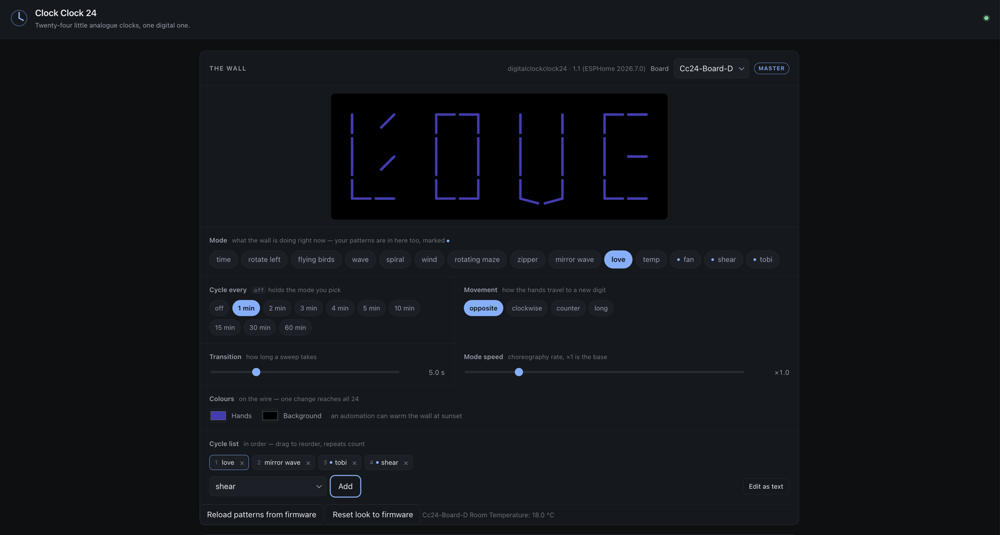
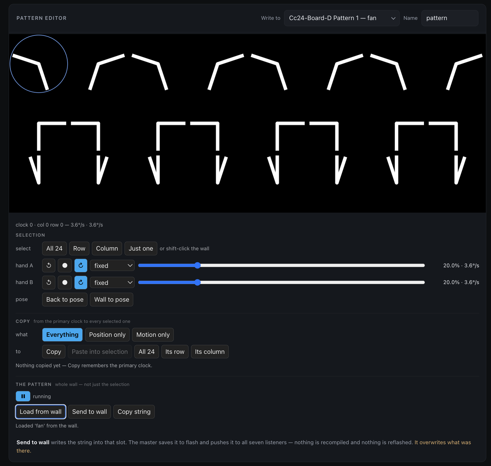

# Digital Clock Clock 24

A **physical [ClockClock 24](https://clockclock.com/)** — a digital clock built
out of twenty-four little analogue ones, where the hands sweep into position to
form the digits and spend the time in between doing something else entirely.

[](https://www.youtube.com/watch?v=BnIoumtDO5s)

*↑ The finished wall, running. [Watch it](https://www.youtube.com/watch?v=BnIoumtDO5s).*

> ### Run it from Home Assistant — no code, no compiling, no reflash
>
> The **[Home Assistant add-on](./homeassistant/README.md)** is how this wall is
> meant to be used. One sidebar item, and it finds your master by itself.
>
> 
>
> *↑ Driving a real wall. The preview is the wall's own engine, so it is showing
> what the wall is showing — here, `love`. `fan`, `shear` and `tobi` are
> patterns drawn in the editor below and sent to the master; they sit in the
> Mode list beside the built-in choreographies and drop into the cycle list like
> any of them.*
>
> | | |
> |---|---|
> | **Drive it** | Mode, cycle list, cadence, movement, sweep length, choreography speed, hand and background colour — live, on the wire, all 24 clocks in one packet |
> | **Draw for it** | The pattern editor, wired straight to a slot on the master: pose the hands, set each one turning, press **Send** |
> | **Automate it** | Every control is an ordinary entity, so amber and slow at sunset is two service calls |
> | **Show it** | A dashboard card, and full-screen pages for wall tablets — with or without hardware |
>
> **Send** is the whole point: the master saves the pattern to flash, pushes it
> down the sync bus, and **24 real analogue clocks are running it a second
> later, with nothing recompiled and nothing reflashed** — not even the master.
> That is what the single-master design is for.
>
> No Home Assistant? The same editor runs standalone on
> **[the project site](https://tuct.github.io/esphome-lvgl-clock/)** — draw
> there, export one line of text, paste it into a field on the master.

The original is a beautiful, expensive piece of kinetic art. This is the same
idea built from **24 round LCD panels and eight £5 microcontrollers**, driven by
[ESPHome](https://esphome.io/) — about **€210**, and it fits on two screws.

| | |
| --- | --- |
| [**Build it — 24 round screens**](#the-build) | The real thing. 24 panels, 8 boards, no gaps. **Running on hardware** |
| [**Build it — 4 screens**](#the-cheap-way-in) | A sixth of the displays, at the cost of a gap between the digits |
| [**What it does**](#what-it-does--the-modes) | The choreographies, and drawing your own in the browser |
| [**Run it**](#in-home-assistant) | The Home Assistant add-on — control panel, pattern editor, tablet views |
| [**Try it now →**](https://tuct.github.io/esphome-lvgl-clock/) | The whole wall in your browser, running the firmware's own engine. Nothing to install |

## The build


Twenty-four 1.28″ round panels on eight XIAO ESP32-S3 boards — **one board per
column of the wall**, three panels each. Evenly spaced across all 24, so
`HH:MM` reads as a single continuous field of clocks, which is the original's
whole point.

One board has Wi-Fi and SNTP and broadcasts the time down a **one-wire UART
bus**; the other seven listen. That is what keeps 24 clocks on the same
millisecond — and it means only one board is ever reflashed to change what the
wall does.

| | |
| --- | --- |
| **Cost** | **€207 – €374** for the whole wall |
| **Size** | ≈ **27 × 13 cm**, **730 g** assembled |
| **Effort** | A project. One custom PCB, 24 panels to mount, 8 boards to flash |
| **Status** | **Running on hardware** — all eight boards built |

→ [**The full build**](./digital_clock_clock_24_24_round_screens) — costed BOM,
carrier PCB and gerbers, wiring, assembly order, bring-up and power.

### The cheap way in


*A printed mock-up of the layout — four digit blocks, and the gaps between them.*

The same clock on **four rectangular panels and two boards**. Each panel draws a
whole digit rather than one mini-clock, so it is a sixth of the displays and an
afternoon rather than a project. The trade is the gaps: four blocks of six
instead of one grid of 24.

Roughly **€70 – €160**, ≈ 17–20 × 6–7 cm. Builds and validates; untested on
hardware.

→ [**The 4-screen build**](./digital_clock_clock_24_4_screens)

## What it does — the modes

Telling the time is the easy part. Every minute the wall breaks into a
**choreography** for 35 seconds and then sweeps back:

| | |
| --- | --- |
| **`wave`** | Each clock is one stroke; the turn rolls across the wall left to right, holding a fixed 15° fan |
| **`wind`** | A column is one stalk. A gust shears its two free ends past each other while the middle stays put |
| **`rotating_maze`** | A chevron lattice that eases almost to a stop every time it lands on an aligned figure |
| **`zipper`** | A front runs across a field of diagonals, unzipping each column into mirrored chevrons |
| **`mirror_wave`** | Vertical strokes scissor open, mirrored about the centre, spreading outwards |
| **`spiral`** · **`flying_birds`** · **`love`** · **`temp`** | …and the rest |

→ [**All of them, in detail**](./modes.md)

### Draw your own — no code, no reflash

Beyond the built-in choreographies, a **pattern** is 24 per-clock poses and
speeds that are *data, not firmware*. You draw one in the **Motion Pattern
Editor**: set a pose and a motion for each clock — a direction per hand and a
speed, either fixed or *"the same as my neighbour, ± a bit"*, so a gradient
across the wall is one number instead of eight.

**In the [Home Assistant add-on](./homeassistant/README.md)** the editor is
wired to a slot on the master. Draw it, watch it run in the real engine, press
**Send** — the master writes it to flash and pushes it down the bus, and the
wall has it a second later. Then its name appears in the Mode list beside
`wave` and `spiral`, and can be dropped into the cycle list like any of them.
Nothing is copied, pasted, compiled or flashed.



*↑ Editing `fan`, pulled back off the wall with **Load from wall** — the slots
are read as well as written, so a pattern already running is a starting point
rather than something you have to have kept a copy of.*

**[Or open the standalone sandbox →](https://tuct.github.io/esphome-lvgl-clock/)** — same engine, no install, nothing
to set up. Draw, export the one line of text, and paste it into a pattern field
on the master. Use it to try the whole wall before you have built one; the
[source is here](./tools/clockclock24-sim/).

Or write a choreography in JavaScript, watch it, and transcribe it into the
firmware — the sandbox is a line-for-line port, so the translation is syntax
only.

> **One rule holds everywhere:** it is an analogue clock, so it cannot jump.
> Every mode is a continuous function of time, and there is a regression check
> that drives all of them through their whole lifecycle to prove it.

## The component underneath

All of this is one ESPHome LVGL widget,
[`lvgl_clock`](./components/lvgl_clock/README.md). It draws a whole ClockClock
24 on a single screen out of the box — `partial:` is what slices the same
24-clock choreography across many displays instead. It also does four other
clock styles, if you just want a clock on a panel:

    

→ [**Component reference**](./components/lvgl_clock/README.md) ·
[**`examples/`**](./examples) — ready-to-flash single-board configs

## In Home Assistant

There is a **[Home Assistant add-on](./homeassistant/README.md)**. Add this
repository under **Settings → Add-ons → ⋮ → Repositories** and it appears in
the store; install it and it is a sidebar item.

**With a wall**, it is the control panel — and everything on it is live, on the
wire, and reaches all 24 clocks in one packet:

| | |
|---|---|
| **Colours** | Hands and background, live |
| **Mode** | The choreographies **and your own patterns, in one list, by name** |
| **Cycle list** | What it rotates through, in order — chips you drag |
| **Cycle every** | How often a window opens, or `off` to hold a choice |
| **Movement** · **Transition** · **Mode speed** | How a hand travels, how long a sweep takes, how fast a choreography runs |

All of it is set on the master and broadcast to the other seven boards, and all
of it is saved to flash — the wall comes back the way you left it after a power
cut. It finds your master by itself, from a project marker the firmware
carries, rather than guessing at entity names.

Every one of those is an **ordinary Home Assistant entity**, so the wall
automates like anything else in the house. A night mode is two service calls —
warm the hands to amber at sunset and slow the choreographies down, back to
white at sunrise:

```yaml
- service: text.set_value
  target: { entity_id: text.cc24_board_d_hand_colour }
  data: { value: "#ff7a2f" }
- service: number.set_value
  target: { entity_id: number.cc24_board_d_mode_speed }
  data: { value: 0.6 }
```

Because the colour goes out as one broadcast, all 24 clocks turn together on
the same frame rather than sweeping across the wall board by board.

**Without one**, it is still a ClockClock 24: the **clock card** puts the whole
wall in a dashboard, and a **display** is a full-screen page with its own link
and its own colours — point a tablet at it and leave it there. Same engine as
the firmware, so it is not an impression of the wall, it is the wall's own code
with a canvas instead of panels.


*↑ A display, configured. It can mirror a real wall or run on its own, and it
has the wall's own controls — mode, rotation, cadence, movement, sweep length,
speed — plus its own colours and, because a screen has no bezels to hide,
a digit gap you can dial in.*

And the **pattern editor** is there too, wired to the wall: draw a pattern,
watch it run, press **Send**, and 24 real clocks are running it a second later.
It lands in one of eight slots on the master, under a name — and from then on
that name sits in the Mode list beside `wave` and `spiral`, and can be dropped
into the cycle list like any of them. Nothing is compiled and nothing is
reflashed, not even the master.

→ [**Add-on and cards**](./homeassistant/README.md) ·
[**Full documentation**](./homeassistant/DOCS.md)
