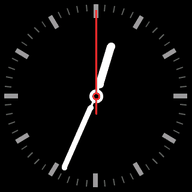

# ESPHome and LVGL based clocks

A clock **widget for [ESPHome](https://esphome.io/)'s LVGL** in five styles —
and two ways to build a physical [ClockClock 24](https://clockclock.com/) out
of it, where a digital clock is made from two dozen little analogue ones.

*↑ The finished 24-screen wall, running. [Watch it](https://www.youtube.com/watch?v=BnIoumtDO5s).*

It started as a ClockClock 24 rendered on a **single** screen — above, one
running as a call button. That works, but it is a picture of the object rather
than the object. So the widget grew a `partial:` option: the **same 24-clock
choreography sliced across many displays**, one mini-clock or one digit each,
with a one-wire UART bus keeping every board on the same millisecond. Eight
boards, twenty-four screens, one clock.

| | |
| --- | --- |
| [**24 round screens**](#digital-clock-clock-24--24-round-screens) | The real thing. 24 panels, 8 boards, no gaps |
| [**4 screens**](#digital-clock-clock-24--4-screens) | The cheap way in. 4 panels, 2 boards |
| [**The component**](#component-to-display-clocks) | Just the widget — five clock styles for any ESPHome display |

## Digital Clock Clock 24 — 24 round screens

Twenty-four 1.28″ round panels on eight XIAO ESP32-S3 boards, one mini-clock
per panel, one board per column of the wall. Evenly spaced across all 24, so
`HH:MM` reads as a single continuous field of clocks — the original's whole
point.

| | |
| --- | --- |
| **Cost** | **€207 – €376** for the whole wall |
| **Size** | ≈ **27 × 13 cm**, **730 g** assembled — eight 34 × 131.6 mm carrier boards side by side |
| **Effort** | A project. One custom PCB, 24 panels to mount, 8 boards to flash |
| **Status** | **Running on hardware** — all eight boards built, the full 24-clock wall |

→ [**Build it**](./digital_clock_clock_24_24_round_screens) — costed BOM,
carrier PCB and gerbers, wiring, assembly order and bring-up.

## Digital Clock Clock 24 — 4 Screens

*A printed mock-up of the layout — four digit blocks, and the gaps between
them.*

The same clock on four 320×240 rectangular panels and two boards — a sixth of
the displays. Each panel renders a whole **digit** rather than one mini-clock.

The trade is the gaps: within a digit the six clocks are evenly spaced, but
every digit boundary carries two bezels, so you get four blocks of six rather
than one grid of 24. Unmistakably the same idea; it just doesn't disappear into
a single surface the way the original does.

| | |
| --- | --- |
| **Cost** | roughly **€70 – €160** — *estimated, not yet a costed BOM* |
| **Size** | ≈ **17–20 × 6–7 cm**, depending on whether you use 2.4″ or 2.8″ panels |
| **Effort** | An afternoon. Two boards, four panels, no mechanical work to speak of |
| **Status** | Builds and validates. **Untested on hardware** |

→ [**Build it**](./digital_clock_clock_24_4_screens) — carrier PCB, wiring and
configs.

## Component to display Clocks

The widget on its own. Add it under `lvgl: widgets:` like `canvas` or `line` —
it owns its canvas and redraws itself, so there is no `interval:` + lambda glue
to write. Five styles:

| `style` | | Example |
| --- | --- | --- |
| **clockclock24** *(default)* |  | [`example_clockclock24.yaml`](./examples/example_clockclock24.yaml) |
| **analog** |  | [`example_analog.yaml`](./examples/example_analog.yaml) · [`example_analog_sbb.yaml`](./examples/example_analog_sbb.yaml) |
| **digital** |  | [`example_digital.yaml`](./examples/example_digital.yaml) · [`example_digital_12h.yaml`](./examples/example_digital_12h.yaml) |
| **flipclock** |  | [`example_flipclock.yaml`](./examples/example_flipclock.yaml) · [`example_flipclock_12h.yaml`](./examples/example_flipclock_12h.yaml) |
| **seg_matrix** |  | [`example_seg_matrix.yaml`](./examples/example_seg_matrix.yaml) |

*Previews rendered with [`tools/gifgen`](./tools/gifgen) — the real component
drawing, run headless against desktop LVGL, so they are pixel-identical to the
device.*

The `clockclock24` style also carries the idle **choreographies** the wall runs
between the minutes — `rotate_left`, `flying_birds`, `wave`, `spiral`, `wind`,
`rotating_maze`, `zipper`, `love` and `temp` — stepped through by
`cycle_modes:` and broadcast to every board so the whole wall animates as one.

→ [**Component README**](./components/lvgl_clock/README.md) — every option, per
style, with the hardware tables.
→ [**`examples/`**](./examples) — ready-to-flash configs and the shared board
and panel packages they include.
→ [**`tools/clockclock24-sim`**](./tools/clockclock24-sim) — the choreography
engine in a browser, for designing new modes without a flash cycle.
