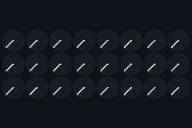
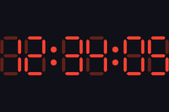
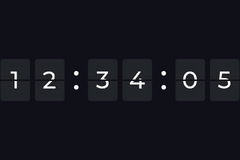
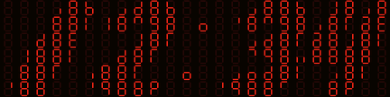
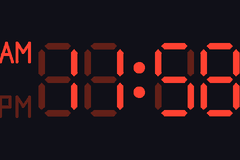
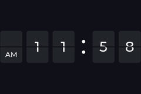
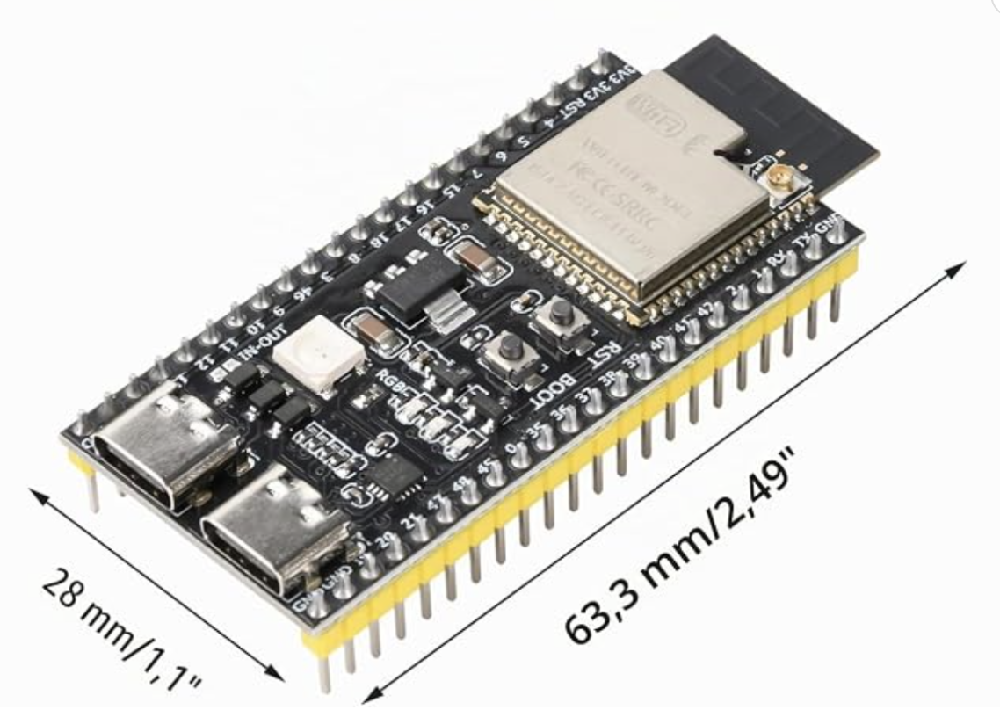

# lvgl_clock — a clock for ESPHome's LVGL

A native [LVGL 9](https://esphome.io/components/lvgl/#widgets) widget: add it
under `lvgl: widgets:` just like `canvas` or `line`. It owns its own canvas
and redraws itself — no `interval:` + lambda glue needed. Pick a **style**:

| `style` | preview | what it looks like |
| --- | --- | --- |
| [**clockclock24**](#style-clockclock24) *(default)* |  | A digital clock built from **24 tiny analogue clocks** ([ClockClock 24](https://clockclock.com/)); hands sweep to form the digits, with `rotate_left` / `flying_birds` idle animations. |
| [**analog**](#style-analog) |  | A classic analogue clock face — independently configurable ticks and per-hand style/colour. |
| [**digital**](#style-digital) |  | `HH:MM(:SS)` as a **7-segment** display with a "ghost 8", optional blinking colon, and an AM/PM column in 12h mode. |
| [**flipclock**](#style-flipclock) |  | `HH:MM(:SS)` as **split-flap cards** with real font-rendered digits and an animated flip on every change ([flipclock.js](https://flipclockjs.com/) look). |
| [**seg_matrix**](#style-seg_matrix) |  | Big `HH:MM` digits drawn on a grid of **small 7-segment displays** — each little display's segments act as pixels of the large numerals (a [7-segment display array](https://hackaday.io/project/169632-7-segment-display-array-clock)). Best on a wide panel. |

*Previews rendered with [`tools/gifgen`](./tools/gifgen) — the real component
drawing run headless against desktop LVGL, so they're pixel-identical to the
device.*

## Contents

- [Usage](#usage) — the minimal config
- [Shared options](#shared-options) — what every style understands
- Styles — preview, options and examples per type:
  [clockclock24](#style-clockclock24) · [analog](#style-analog) ·
  [digital](#style-digital) · [flipclock](#style-flipclock) ·
  [seg_matrix](#style-seg_matrix)
- [Examples and hardware](#examples-and-hardware) — ready-to-flash configs,
  the [boards](#boards) and [panels](#display-panels) they run on, and the
  shared packages that wire them up
- [Resolution](#resolution) and [PSRAM](#psram-large-displays) — sizing the canvas

## Usage

```yaml
external_components:
  - source: { type: git, url: https://github.com/tuct/esphome-lvgl-clock, ref: main }
    components: [lvgl_clock]

time:
  - platform: sntp
    id: sntp_time
    timezone: "CET-1CEST,M3.5.0,M10.5.0/3"

# Marker only - enables the widget below, takes no options itself. Required
# because ESPHome only loads a component's code when its domain appears as a
# top-level YAML key.
lvgl_clock:

lvgl:
  displays: [my_display]
  widgets:
    - lvgl_clock:
        id: dc
        time_id: sntp_time
        width: 150
        height: 128
        style: analog
        show_seconds: true
```

Position and size (`x`, `y`, `width`, `height`, `align`, ...) are ordinary
LVGL widget properties — set them like on any other widget. `width`/`height`
are required here (used to size the canvas buffer).

The **style is chosen by the `style:` key** — `clockclock24` / `analog` /
`digital` / `flipclock` / `seg_matrix`. If omitted, it's inferred from
whichever one style sub-block (`clockclock24:` / `analog:` / ...) you provide,
defaulting to `clockclock24` if none are given.

## Shared options

| Option | Default | Description |
| --- | --- | --- |
| `time_id` | *(required)* | A `time:` component. |
| `width` / `height` | *(required)* | Canvas size in px. |
| `style` | `clockclock24` | `clockclock24`, `analog`, `digital`, `flipclock`, or `seg_matrix`. |
| `twenty_four_hour` | `true` | `false` = 1–12. enables am/pm on `digital`, or `flipclock`.  |
| `show_seconds` | `false` | Adds `:SS` (`digital`/`flipclock`) or a sweeping second hand (`analog`). **No-op for `clockclock24`** — the physical ClockClock 24 has no seconds display. |
| `render_interval` | `16ms` | How often the widget redraws itself (~60 fps). |
| `foreground` | white | The "ink": hands / markers / digits. |
| `background` | black | Behind everything. Ignored when `transparent`. |
| `transparent` | `false` | Clear the canvas to fully transparent each frame instead of filling `background`, so other LVGL widgets placed **behind** the clock (listed earlier in `widgets:`) show through the gaps between hands/ticks/digits. Allocates an **ARGB8888** canvas — **4 bytes/px instead of 2**, so it needs roughly double the RAM (likely PSRAM at larger sizes). |

Before the time source first syncs, `analog` / `digital` / `flipclock` show a
fake **00:15** with the seconds running off uptime, so the clock looks alive
instead of showing dashes. `clockclock24` instead parks its hands until the
first sync — or runs whatever idle animation you drive it with during the
wifi/NTP boot phase (see its mode actions below).

`foreground` and `background` are the only **shared** colours (they mean the
same thing in every style). Face-specific colours live inside the style
block that uses them — see below. All colours take the **id of a `color:`
component** and are optional; omit for white-on-black.

### Transparent background / layering other widgets

With `transparent: true` the clock clears its canvas to fully transparent each
frame instead of filling `background`, so any LVGL widget placed **behind** it
(listed *earlier* in the `widgets:` list — earlier = lower z-order) shows
through the gaps between the hands/ticks/digits. This is how you put e.g. a
date label, an image, or a coloured backdrop behind the clock. For example, a
date drawn with a plain `label` (nothing to do with this component) behind a
transparent analog face:

```yaml
lvgl:
  widgets:
    - label:                 # drawn first => behind the clock
        id: date_label
        align: CENTER
        y: 70
        text_font: montserrat_24
        text: ""
    - lvgl_clock:
        id: dc
        time_id: sntp_time
        width: 320
        height: 320
        style: analog
        transparent: true    # face is see-through; the label shows through

# update the label from the time component (the clock never renders a date)
interval:
  - interval: 30s
    then:
      - lvgl.label.update:
          id: date_label
          text: !lambda 'return id(sntp_time).now().strftime("%a %d.%m");'
```

A full version is in [`example_analog.yaml`](./examples/example_analog.yaml).

**Cost:** transparency needs an alpha channel, so the canvas is allocated as
**ARGB8888** — 4 bytes/px instead of RGB565's 2, i.e. roughly double the RAM
(e.g. 320×320 ≈ 410 KB). On a non-PSRAM ESP32 that allocation may fail; the
widget logs an error and disables itself (blank clock) rather than crashing —
shrink the canvas or add PSRAM.

## `style: clockclock24`


```yaml
clockclock24:
  hand_width: 1             # base hand thickness (px)
  movement: opposite        # opposite | clockwise | counter | long
  transition_length: 2s      # sweep duration on a time change
  mode: time                 # time | rotate_left | flying_birds | demo
  mode_speed: 1.0             # idle-animation speed multiplier (rotate_left/flying_birds only)
  spacing: 0.0                # gap between HH and MM, in clock-widths
  demo_interval: 5s           # `mode: demo` only - see below
  show_face: false            # draw a filled disc behind each mini-clock's hands
  face_color: ...             # little-clock fill (needs show_face)
  border_color: ...           # little-clock rim (needs show_face)
```

Examples: [`example_clockclock24.yaml`](./examples/example_clockclock24.yaml),
[`example_clockclock24_demo.yaml`](./examples/example_clockclock24_demo.yaml).

Each mini-clock has two hands, and `movement` controls which direction each
takes to reach its new target angle:

- `opposite` *(default)* — the two hands travel in opposite directions from
  each other (one clockwise, one counter-clockwise) — the classic ClockClock
  24 look, hands seeming to open/close like scissors.
- `clockwise` — both hands always travel clockwise.
- `counter` — both hands always travel counter-clockwise.
- `long` — each hand independently takes whichever direction is the *longer*
  way around, for a more dramatic full sweep.

**Idle-animation actions** (drive from automations): `lvgl_clock.show_time`,
`lvgl_clock.rotate_left`, `lvgl_clock.flying_birds` — e.g. spin while
Wi-Fi connects, birds while waiting for NTP, then the time. See
[`example_clockclock24.yaml`](./examples/example_clockclock24.yaml).

**Testing the digit-flip animation** — clockclock24 only re-animates on an
actual minute change, so watching it live can mean waiting up to 60 real
seconds to see a flip. `mode: demo` (action: `lvgl_clock.demo`) advances a
fake internal minute every `demo_interval` (default `5s`) instead of reading
the real clock, so you can watch the animation repeatedly on demand. See
[`example_clockclock24_demo.yaml`](./examples/example_clockclock24_demo.yaml) for a
config that boots straight into it.

## `style: analog`


```yaml
analog:
  show_face: false            # draw the dial circle behind the hands
  minute_ticks:               # 60 small 1-min ticks
    enabled: true
    color: ...                  # defaults to `border_color`
    rounded: true                 # rounded vs flat/square tick ends
    width: m                       # s | m | l
    length: m                      # s | m | l
  hour_ticks:                 # 12 bold 5-min/hour ticks
    enabled: true
    color: ...
    rounded: true
    width: m
    length: m
  face_color: ...             # dial fill (needs show_face)
  border_color: ...           # dial rim + default tick colour (needs show_face)
  hour_hand:
    style: baton               # baton | line | line_rounded | lollipop | sbb
    color: ...                  # defaults to `foreground`
    center_style: circle         # circle | round | none
    extend: 0%                    # extend the hand past the pivot, max 50%
  minute_hand:
    style: baton
    color: ...
    center_style: circle
    extend: 0%
  second_hand:
    style: lollipop             # needs `show_seconds: true` (shared option)
    color: ...                  # defaults to red
    center_style: circle
    extend: 20%                # a short counterweight tail, like a real second hand
```

Examples: [`example_analog.yaml`](./examples/example_analog.yaml),
[`example_analog_sbb.yaml`](./examples/example_analog_sbb.yaml) (Mondaine/SBB
showcase).

Continuous sweep — all hands glide (no ticking or stop-to-go pause). Hands and
ticks are independently configurable, so this one style covers everything
from a bare minimalist face (no ticks, thin second hand) to a fully ticked
watch face.

`minute_ticks`/`hour_ticks` are independent: `enabled` toggles that ring on/off
(if `hour_ticks.enabled: false` but `minute_ticks.enabled: true`, the minute
styling fills in at the hour positions too, so you still get a full ring
instead of 12 gaps); `color` overrides it (defaults to `border_color`);
`rounded` picks flat/square vs rounded tick ends; `width`/`length` pick a
size (`s`/`m`/`l`) — the scale is shared, so `s`/`m`/`l` mean the same
absolute size on either ring. Each ring defaults to its own historical look
(`minute_ticks`: `s`, `hour_ticks`: `l`) unless overridden.

Each hand is fully independent:
- `style` picks the shape — `baton`: a tapered stalk into a thick rounded bar
  (circle -> line -> rounded rectangle, doesn't start flush at the pivot);
  `line`: a thin plain line with flat/square ends; `line_rounded`: the same
  thin line but with rounded ends; `lollipop`: a thin line ending inside a
  solid ball ~65% of the way along it (the classic Mondaine/SBB second-hand
  look); `sbb`: a plain, only slightly tapered rectangle with flat-cut ends —
  the classic Swiss railway hour/minute hand, intended for those two hands.
- `color` overrides the hand's colour (defaults to `foreground`, or red for
  `second_hand`).
- `center_style` picks how *that hand's own* centre marker looks: `circle`
  *(default)* draws a ring in the hand's colour around a black centre; `round`
  draws a plain filled circle in the hand's colour; `none` draws nothing.
  Each hand renders fully (shape, then its own marker) before the next one
  starts — hour, then minute on top of it, then second on top of both, like a
  real watch — so with all three left at `circle` you get a layered
  black/ring/ring hub; set the ones you don't want to `none`.
- `extend` stretches the hand a little past the pivot on the *opposite* side
  (max 50%) — e.g. the second hand's small counterweight tail.

## `style: digital`


```yaml
digital:
  segment_style: classic     # classic | rounded
  blink: false               # colon blinks (to the off_color "ghost")
  blank_leading_zero: false  # hide the leading hour zero
  off_color: ...             # colour of *unlit* segments - the classic "ghost 8"
```

Examples: [`example_digital.yaml`](./examples/example_digital.yaml),
[`example_digital_12h.yaml`](./examples/example_digital_12h.yaml).

Self-contained **7-segment** display — no font needed.

`segment_style` picks the shape of each of the 7 bars: `classic` *(default)*
tapers each end to a point — the traditional LCD/calculator look. `rounded`
uses fully rounded capsule ends instead. Either way the segments are separated
by a thin unlit gap, like a real 7-segment display.

In 12h mode (`twenty_four_hour: false`) an **AM/PM** marker column appears on
the left, like on a real LED clock module: AM on top, PM below, the active
one lit and the other shown in the `off_color` ghost. The letters are drawn
as vector strokes (no font needed) and auto-scale with the widget like the
digits themselves.



*12h mode with the AM/PM column, rolling over noon —
[`example_digital_12h.yaml`](./examples/example_digital_12h.yaml).*

## `style: flipclock`


```yaml
flipclock:
  font: montserrat_48        # built-in LVGL font name, or an ESPHome font: id
  card_color: ...            # card fill - defaults to a dark grey
  flip_duration: 450ms       # one digit flip; 0 disables the animation
  blink: false               # divider dots blink off every other second
  blank_leading_zero: false  # hide the leading hour zero (blank card)
  show_dots: true            # false = no divider dots, just a gap between groups
  am_pm_font: montserrat_14  # 12h mode only - small AM/PM marker font
```

Examples: [`example_flipclock.yaml`](./examples/example_flipclock.yaml),
[`example_flipclock_12h.yaml`](./examples/example_flipclock_12h.yaml).

Split-flap ("Solari") cards, one digit per card, with a horizontal seam and
an animated flip on every digit change — the [flipclock.js](https://flipclockjs.com/)
look. Unlike `digital` this renders **real font glyphs**, so a `font:` is
required.

- `font` takes either a **built-in LVGL font** (`montserrat_8` …
  `montserrat_48` — the validator enables it in the LVGL build
  automatically) or the id of an ESPHome
  [`font:`](https://esphome.io/components/font/) component, for any size or
  typeface. The glyph size is fixed by the font, so match it to the widget:
  the cards themselves scale to `width`/`height`, the digits don't.
  **Built-in fonts stop at `montserrat_48`** — for bigger, crisp digits use
  an ESPHome `font:` (a TTF at any `size:`, e.g. `120`). Two gotchas: give it
  an id that is *not* a built-in font name (a colliding id like
  `montserrat_48` is matched as the built-in and your component ignored), and
  set `size:` explicitly (ESPHome fonts default to 20). Scaling a built-in
  bitmap font up instead would just look blocky.
- Digit colour is the shared `foreground`; the gaps between cards and the
  seam line show `background`.
- The flip is the classic two-phase flap: the top half falls over the old
  digit, then lands on the bottom half revealing the new one, easing in like
  a real gravity-driven flap.
- In 12h mode (`twenty_four_hour: false`) a dedicated **AM/PM** card is added
  in front of the hours, like on a real flip clock, with the marker sitting
  centred in the lower half of the card — `am_pm_font` sizes its two-letter
  text (any built-in LVGL font or ESPHome `font:` id; defaults to a small one).



*12h mode with the dedicated AM/PM card, flipping over noon —
[`example_flipclock_12h.yaml`](./examples/example_flipclock_12h.yaml).*

## `style: seg_matrix`


```yaml
seg_matrix:
  segment_style: classic     # classic | rounded - shape of each small segment
  off_color: ...             # colour of the unlit ghost grid (default dark)
```

Example: [`example_seg_matrix.yaml`](./examples/example_seg_matrix.yaml).

Big `HH:MM` digits drawn on a fixed **6×24 grid of small 7-segment displays**,
using the hand-crafted segment font from the
[7-segment display array clock](https://hackaday.io/project/169632-7-segment-display-array-clock)
(ported verbatim) — each small display shows the exact segment pattern that
builds up the large numerals, with the rest of the grid as an unlit ghost.

`foreground` is the lit colour and `off_color` the ghost grid. The grid and
font are fixed at the reference **6×24** (so it's a **wide** layout, ~4:1) —
each small display keeps its 7-segment aspect ratio and is centred in its cell,
so on a squarer display they just get larger and more spaced out.

## Examples and hardware

The configs linked from each style above live in [`examples/`](./examples) —
one ready-to-flash file per style. Each is deliberately tiny (just its
`esphome: name:` plus the `lvgl: widgets: - lvgl_clock: ...` block for that
style) because the board and the panel come in via `packages:` + `!include`
from two shared files — pick one of each:

```yaml
packages:
  base: !include common_base_esp32_s3_devkit.yaml            # <- the board
  display: !include common_tft_4_0_spi_st7796_320_480.yaml   # <- the panel
```

> **The hardware below is only what these packages were tested on — not a
> compatibility list.** `lvgl_clock` is a plain LVGL widget drawing into its
> own canvas, so it runs on **any ESP32 variant and any display ESPHome's
> [LVGL component](https://esphome.io/components/lvgl/) can drive** — SPI,
> parallel/RGB, big or small. The packages just save you writing the
> boilerplate for the combinations that were on the bench.

### Boards

Tested on the two below; **any ESPHome-supported ESP32 works**. The one thing
that matters is RAM: the clock's canvas is `width × height × 2` bytes, so a
480×320 face alone is ~300 KB — more than a plain ESP32's internal RAM, and
LVGL still needs its own buffers on top. Hence the recommendation of an
**ESP32-S3 with PSRAM** for larger panels; a classic ESP32 without PSRAM is
fine for the small ones.

| | Board | Base package | Notes |
| --- | --- | --- | --- |
|  | **ESP32-S3-DevKitC-1** (N16R8) — [buy](https://amzn.to/45yvsfR) | [`common_base_esp32_s3_devkit.yaml`](./examples/common_base_esp32_s3_devkit.yaml) | 16 MB flash, 8 MB octal PSRAM, every GPIO on a header. What all the examples ship with, and the easiest to wire up. |
|  | **Seeed Studio XIAO ESP32-S3** — [buy](https://amzn.to/4bp2pPv) | [`common_base_esp32_s3_xiao.yaml`](./examples/common_base_esp32_s3_xiao.yaml) | Thumbnail-sized (21×17.5 mm) with the same 8 MB PSRAM — the one to use when the clock has to disappear into an enclosure. Fewer pins, so the package uses the XIAO's SPI header: D8/D10/D9 for CLK/MOSI/MISO, D1/D2/D3 for CS/DC/RESET. |

The two packages are identical apart from the `board:` and the pin
substitutions, so switching is a one-line change to `base:`. Porting to a
third board is the same edit — copy one, change the `board:` and the six pin
substitutions.

### Display panels

Again, three *tested* panels, not a limit — anything LVGL can drive will do.
These happen to be `mipi_spi` modules on the same four-wire bus, named
`common_tft_<size>_<bus>_<chip>_<native resolution>.yaml`, each shipping its
own [size substitutions](#substitutions):

| | Panel | Package | Landscape size | Notes |
| --- | --- | --- | --- | --- |
|  | **4.0" ST7796**, 320×480 — [buy](https://amzn.to/4fQuHnl) | [`common_tft_4_0_spi_st7796_320_480.yaml`](./examples/common_tft_4_0_spi_st7796_320_480.yaml) | **480×320** | The big one — the only panel with room for `seg_matrix` and for `flipclock` at a 100 px font. 80 MHz `data_rate`, `draw_rounding: 4`. What every example ships with. |
|  | **1.69" ST7789V2**, 240×280 — [buy](https://amzn.to/4fzuExq) | [`common_tft_1_69_spi_st7789v2_240_280.yaml`](./examples/common_tft_1_69_spi_st7789v2_240_280.yaml) | **280×240** | Rounded-corner IPS module, 48×30 mm — a nice desk clock. No MISO; needs `invert_colors: true` and `offset_height: 20` (the glass sits 20 px down in the controller's 240×320 frame buffer), both already in the package. |
|  | **1.8" ST7735**, 128×160 — [buy](https://amzn.to/4pReNh6) | [`common_tft_1_8_spi_st7735_128_160.yaml`](./examples/common_tft_1_8_spi_st7735_128_160.yaml) | **160×128** | The cheap classic. No MISO line. Fine for `analog`, `digital` and `clockclock24`; too small for `seg_matrix`. |

Each file is a plain ESPHome
[`display:`](https://esphome.io/components/display/) config, so adding your own
panel means copying whichever ESPHome config it already ships with and keeping
three things: `id: my_display`, the `lvgl:` binding, and the two size
substitutions. Nothing in the widget cares which controller is underneath — it
scales to whatever canvas you give it, though it can't be larger than the
screen; see [Resolution](#resolution) for the practical minimum per style. The
canvas is allocated as RGB565 (or ARGB8888 when `transparent:`), so a colour
LVGL build is assumed; monochrome and e-paper panels are untested, and a slow
panel wants a much slower `render_interval:` than the 16 ms default either way.

### What each package provides

| File | What it provides |
| --- | --- |
| a **base** (`common_base_*.yaml`) | Everything that isn't the panel: the board and framework, `psram:`, `wifi:` / `api:` / `ota:` / `logger:`, the `external_components:` pointer at `../components`, the `time: sntp` source (`id: sntp_time`), the bare `lvgl_clock:` marker key, the shared `color:` palette — `cc_hands` (white ink), `cc_bg` (black), `cc_faces` (the dark "ghost"/face grey) — and the **pin** substitutions. |
| a **display** (`common_tft_*.yaml`) | The `spi:` bus, the `display:` component (always `id: my_display`), the `lvgl:` binding for it (`displays:`, `rotation: 90`, black `bg_color`) and the **size** substitutions. Pins come from the base, so a panel file has no hard-coded GPIOs. |

`packages:` merges dicts key-by-key, so the display file's `lvgl:` keys and the
example's own `lvgl: widgets:` key combine into a single `lvgl:` block — which
is why swapping hardware is a one-line edit.

### Substitutions

The pins and the clock size are each declared once and read everywhere else,
so nothing is duplicated between the panel and the widget:

| Substitution | Declared in | Default | Used by |
| --- | --- | --- | --- |
| `clk_pin` / `mosi_pin` / `miso_pin` | the base | `GPIO18` / `GPIO13` / `GPIO12` | the display file's `spi:` bus |
| `reset_pin` / `cs_pin` / `dc_pin` | the base | `GPIO04` / `GPIO16` / `GPIO17` | the display file's `display:` |
| `clock_width` / `clock_height` | **the display file** | that panel's landscape size | the `lvgl_clock` widget's `width:` / `height:` |

`clock_width`/`clock_height` live in the display file, so they always describe
the panel you actually included — swapping the `display:` line resizes the
clock with it, no second edit. The square-faced analog examples deliberately
use `${clock_height}` for *both* sides, so the dial stays round on a landscape
panel.

Override any substitution with a top-level `substitutions:` block in the
example (the outer file wins over a package's), e.g. to rewire the bus:

```yaml
substitutions:
  mosi_pin: "GPIO11"
  clk_pin: "GPIO12"
```

### The examples

All of them ship on the 4.0" ST7796, i.e. a 480×320 canvas. "Widget size" is
the `width`/`height` on the `lvgl_clock` widget itself:

| Example | Style | Widget size | What it shows |
| --- | --- | --- | --- |
| [`example_clockclock24.yaml`](./examples/example_clockclock24.yaml) | clockclock24 | full screen | The full boot sequence: `rotate_left` while Wi-Fi connects, `flying_birds` while waiting for NTP, then the time — driven from an `interval:` with the mode actions. |
| [`example_clockclock24_demo.yaml`](./examples/example_clockclock24_demo.yaml) | clockclock24 | full screen | Boots straight into `mode: demo` so the digit-flip animation repeats every 5 s instead of once a minute. Handy for trying out the `movement:` options. |
| [`example_analog.yaml`](./examples/example_analog.yaml) | analog | square (320×320) | Every analog option at once, plus `transparent: true` with a plain LVGL `label:` **behind** the face showing the date through the gaps. |
| [`example_analog_sbb.yaml`](./examples/example_analog_sbb.yaml) | analog | square (320×320) | The Mondaine/SBB Swiss railway look: black-on-white, `sbb` hands, `lollipop` second hand. |
| [`example_digital.yaml`](./examples/example_digital.yaml) | digital | full screen | 24 h `HH:MM` 7-segment with a blinking colon and the ghost 8. |
| [`example_digital_12h.yaml`](./examples/example_digital_12h.yaml) | digital | full screen | Same in 12 h mode — adds the vector-drawn AM/PM marker column. |
| [`example_flipclock.yaml`](./examples/example_flipclock.yaml) | flipclock | full screen | Split-flap cards with a Google-font TTF (`font:` at `size: 100`) — the recommended way to get large crisp digits. |
| [`example_flipclock_12h.yaml`](./examples/example_flipclock_12h.yaml) | flipclock | full screen | Same in 12 h mode — adds the dedicated AM/PM flap card. |
| [`example_seg_matrix.yaml`](./examples/example_seg_matrix.yaml) | seg_matrix | full screen | The 6×24 grid of small 7-segment displays with a dark red ghost grid. |

The examples read Wi-Fi/API/OTA credentials from `secrets.yaml` — copy
[`secrets.yaml.example`](./examples/secrets.yaml.example) to
`examples/secrets.yaml` and fill it in. Then:

```bash
esphome compile examples/example_clockclock24.yaml
esphome run     examples/example_clockclock24.yaml
```

## Resolution

Auto-scales to the draw area; the first render logs the actual size vs the
recommended minimum, per style:

| Style | Practical minimum |
| --- | --- |
| clockclock24 | ~128×48 at the default spacing (a 128×64 OLED is the sweet spot) |
| analog | ~24×24 (bigger = more detail) |
| digital | ~24×12 (the 7-segment renderer is self-contained - no font, scales freely) |
| flipclock | font-dependent - the cards scale, the glyphs don't; pick a font that fits |
| seg_matrix | fixed 6×24 grid, ~144×60 px min; wants a wide (~4:1) panel |

### PSRAM (large displays)

The widget's canvas buffer is `width × height × 2` bytes (×4 with
`transparent:`). A full-colour display like 480×320 needs ~300 KB, which won't
fit in an ESP32-S3's internal RAM — enable **PSRAM** so LVGL has room:

```yaml
# enable PSRAM for the ESP32-S3 - required for LVGL at 480x320
psram:
  mode: octal      # check your board's PSRAM mode; octal is the ESP32-S3 default
  speed: 80MHz

display:
  - platform: mipi_spi
    id: my_display
    model: "ST7796"
    data_rate: 80MHz   # to ensure framerate
```

Without enough free RAM the canvas allocation fails; the widget logs an error
and disables itself (blank clock) rather than crashing.

## Credits

ClockClock 24 by *Humans since 1982*;
JS reference by *Manuel Wieser*.
Analog face after the *SBB* Swiss railway clock (Hans Hilfiker, 1944).
`seg_matrix` after the [7-segment display array clock](https://hackaday.io/project/169632-7-segment-display-array-clock).
