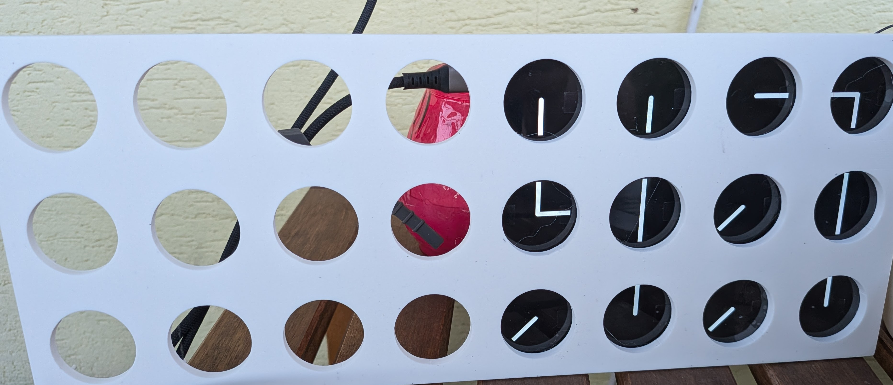
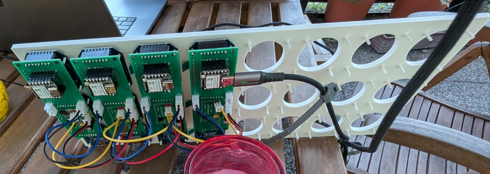
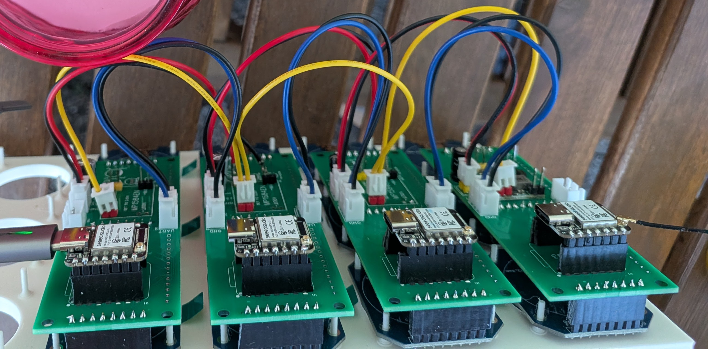
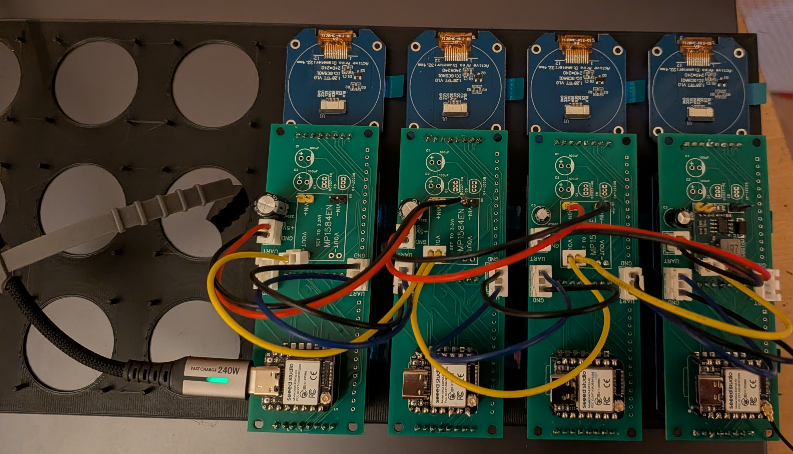

# First prototype — twelve of the twenty-four

Twelve clocks on four boards, four wall columns. This is the half-built stage
of [the 24-round-screen wall](./README.md), kept because it is the more useful
thing to look at if you are building one: everything is still reachable, and
you can see how a column goes together before 24 panels are glued into a case.

The back of the same panel. Four carrier boards, each holding a XIAO and three
round displays, chained left to right:

The chain close up. Four wires hop from board to board — `+5 V`, `GND`, `+3.3 V`
and the sync `UART` — and **most of the `MP1584EN` footprints are empty**:

On the bench before mounting, with the GC9A01A panels dry-fitted above their
carriers:

---

The finished wall — all eight boards, in a printed case — is in
[the build README](./README.md#first-full-build).
