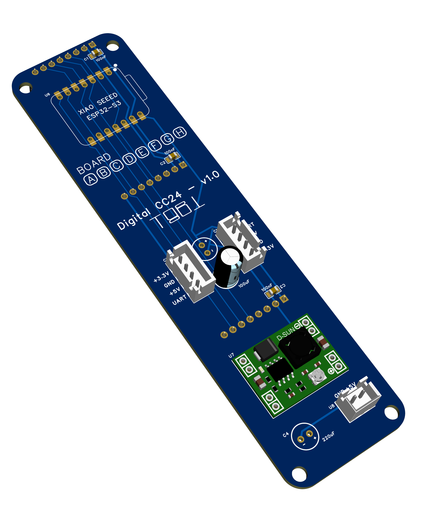

# digital_clock_clock_24 — the path to this project

Years ago I stumbled on [ClockClock 24](https://clockclock.com/) by Humans
since 1982 and immediately fell in love with the concept: a digital clock made
out of 24 analogue clocks. Genius.

The original is wonderful and well out of my budget, so I started coding a
version for an ESP32 with ESPHome. Here is one in use — a "call button" plus a
clock in ClockClock 24 style:


I also run versions on tablets: a full-screen browser showing a JS version
hosted on my Home Assistant.


Those are fine, but I wanted to get closer to the original without using real
analogue clocks.

The next step was four displays, one per two columns, in a 3D-printed frame.
Quite nice — but the gap between the digits ends up wider than the gaps between
the clocks inside a digit:


→ [the four-screen version](../digital_clock_clock_24_4_screens)

To get rid of that gap I tried the crazy approach: 24 round displays, one per
clock. It worked.

## digital_clock_clock_24 — a physical ClockClock 24, on 24 round screens

24 round displays forming one [ClockClock 24](https://clockclock.com/), driven
by **8 XIAO ESP32-S3 boards with 3 panels each**. Every board runs the same
[`lvgl_clock`](../components/lvgl_clock/README.md) `clockclock24` engine, and each panel renders
**one** of the 24 mini-clocks (`partial: 0…23`), so the digit sweeps,
`movement:` directions and idle animations stay identical across the wall by
construction.

One board has Wi-Fi and SNTP and broadcasts the time over a one-wire UART bus;
the other seven listen. The master drives three panels too — it is board C, not
a ninth box.

> **Status:** running on hardware — 12 of the 24 clocks built. See
> [First prototype](#first-prototype).
>
> **Cost:** roughly **€206–€376** for the full 24-clock wall — the spread is
> almost entirely where you buy the XIAOs. See [BOM and cost](#bom-and-cost).

## First prototype

Twelve of the twenty-four clocks running — four boards, four wall columns:


The back of the same panel. Four carrier boards, each holding a XIAO and three
round displays, chained left to right:


The chain close up. Four wires hop from board to board — `+5 V`, `GND`, `+3.3 V`
and the sync `UART` — and **most of the `MP1584EN` footprints are empty**:


On the bench before mounting, with the GC9A01A panels dry-fitted above their
carriers:


## What you need

### BOM and cost

Everything for the full eight-board, 24-clock wall. Quantities come from the
[netlist](./PCB/Netlist_Schematic3_2026-08-19.tel); prices are what the parts
cost when they were last checked, so treat them as a starting point rather than
a quote.

| Part | Qty | € / unit | € total | Where / note |
| --- | ---: | ---: | ---: | --- |
| 1.28″ 240×240 round GC9A01A panel | 25 | 4.7&nbsp;–&nbsp;5.6 | 118&nbsp;–&nbsp;140 | [5-pack, €23.49](https://amzn.to/4xJpK79) — 5 packs: 24 used, 1 spare |
| Seeed XIAO ESP32-S3 | 8 | 5.6&nbsp;–&nbsp;15.2 | 45&nbsp;–&nbsp;122 | [3-pack ~€15 at Seeed](https://www.seeedstudio.com/Seeed-Studio-XIAO-ESP32S3-3PCS-p-5919.html) vs [€15.16 each on Amazon](https://amzn.to/4zm4KF8) |
| Custom PCB — [gerbers](./PCB/Gerber_PCB3_2026-08-19.zip) | 8 | 2.5&nbsp;–&nbsp;3.8 | 20&nbsp;–&nbsp;30 | one fab order, 2-layer 34 × 131.6 mm |
| MP1584EN buck module — `U7` | 2 | 1&nbsp;–&nbsp;5 | 2&nbsp;–&nbsp;10 | [10-pack, €10](https://amzn.to/4g2qbn7). **Not one per board** — see [How many regulators](#how-many-regulators-and-where) |
| JST-XH 4-pin connector — `CN1`, `CN3` | 16 | 0.2&nbsp;–&nbsp;0.4 | 3&nbsp;–&nbsp;6 | chain in / chain out; sold in 20/50-packs |
| JST-XH 2-pin connector — `U8` | 0&nbsp;–&nbsp;1 | 0.2&nbsp;–&nbsp;0.4 | 0&nbsp;–&nbsp;1 | **Optional**, and only on the board you feed — skip it if you power the wall by plugging USB-C into that board's XIAO |
| 4-way chain cable — housing, crimps, wire | 7 | 0.7&nbsp;–&nbsp;1.6 | 5&nbsp;–&nbsp;11 | one per hop between boards |
| 8-pin female header 2.54 mm — `U3`/`U4`/`U5` | 24 | 0.2&nbsp;–&nbsp;0.4 | 5&nbsp;–&nbsp;10 | one per panel; or cut from 40-pin strips |
| 7-pin female header 2.54 mm — `U6` | 16 | 0.2&nbsp;–&nbsp;0.4 | 3&nbsp;–&nbsp;6 | the XIAO socket, 2 × 7; also cut from strips |
| 100 nF 0805 — `C1`–`C3` | 0&nbsp;–&nbsp;24 | <&nbsp;0.1 | 0&nbsp;–&nbsp;2 | **Optional**, recommended. **The only SMD part** — sold in 100-packs |
| 220 µF electrolytic — `C4`, `C6` | 0&nbsp;–&nbsp;16 | 0.1&nbsp;–&nbsp;0.3 | 0&nbsp;–&nbsp;5 | **Optional**, recommended. Bulk on the 5 V rail; through-hole, 6.3 mm |
| 100 µF electrolytic — `C5` | 0&nbsp;–&nbsp;8 | 0.2&nbsp;–&nbsp;0.4 | 0&nbsp;–&nbsp;3 | **Optional**, recommended. Bulk on the 3.3 V rail; through-hole, 6.3 mm |
| 5 V 2 A USB supply | 1 | 0&nbsp;–&nbsp;15 | 0&nbsp;–&nbsp;15 | one for the whole wall; €0 if you have one |
| [3D-printed frame](#3d-printed-frame) | 1 | 5&nbsp;–&nbsp;15 | 5&nbsp;–&nbsp;15 | filament only, if you print it yourself |
| **Total** | | | **€&nbsp;206&nbsp;–&nbsp;376** | |

**Where the money goes.** The panels are the floor — €118 of it, and there is
no way around 24 displays. The one real decision is the **XIAO**: buying
3-packs from Seeed instead of singles from Amazon saves about **€77**, a third
of the cheap build. Everything else together is under €60.

**Reading the table.** `Qty` is what the finished wall holds, and every row
multiplies out — `qty × unit = total`. The unit prices for passives and headers
are **pack prices divided down**, because nobody sells 24 individual 0805s: you
buy a 100-pack, a couple of 40-pin header strips and a bag of XH housings, pay
the pack price once and keep the remainder. So the small rows are what those
parts *cost you here*, not what you will spend at the checkout — expect a few
euro more and a drawer of spares.

**The capacitors are optional.** The boards work with none of them fitted,
which is why they carry a `0` low bound above. Fit them anyway if
you can: `C1`–`C3` sit on the panel headers and `C4`–`C6` on the two rails, and
they are what keeps 24 backlights striking at once from browning out the SPI
bus. Skipping them is a reasonable first-board shortcut, not the finished
build.

Three things that are *not* eight-off, and are easy to over-order:

- **The MP1584EN.** One or two modules feed the whole chain; the rest of the
  boards leave the footprint empty. A 10-pack is already several builds' worth.
- **The 5 V supply.** A single **5 V 2 A USB supply is fine for the whole
  wall** — all eight boards together draw ~1.2 A. One supply, fed into the
  middle of the row; not one per board.
- **The `U8` 2-pin connector.** Only the board you feed needs one, and even
  that one is optional: USB-C into that board's XIAO lands on the same `+5 V`
  net, so you can populate none of them.

### 3D-printed frame

The wall needs a frame: a face plate with 24 round cutouts, and something
behind it to hold the eight carrier boards at the right spacing.

*Print settings, STLs and assembly notes to follow.*

## How to build

### Hardware assembly

**Build and prove one board before you build eight.** A single XIAO tests every
carrier: solder a board, plug the XIAO into it, confirm all three screens come
up, then move that XIAO to the next board. Eight boards assembled and only then
powered is eight boards to debug at once.

**Build board C first — it is your test rig.** C is the master *and* the
regulator board: it is the only one with `wifi:`, and it carries the `U7`
MP1584 and the 5 V input. That is deliberate — the middle of the row, so the 3.3 V it makes has at most four boards to reach in either
direction. That module is the *only* source of the 3.3 V the panels run on: a
board without one has no panel supply of its own, so testing it means chaining
it to the regulator board with a 4-pin cable and letting `+3.3 V` come down the
chain. Keep that board on the bench for the rest of the build.

**1. Solder one board, lowest parts first.**

| Order | Parts | Note |
| --- | --- | --- |
| 1 | `C1`–`C3`, 100 nF 0805 | Only if you are fitting them — see [the BOM](#bom-and-cost). SMD, so they go on while the board is still flat |
| 2 | `U7`, the MP1584 module | Only the one or two boards that carry a regulator. It lies flat on its footprint and is soldered through its pads — poor-man's SMD, and much easier before the tall parts |
| 3 | `U3`/`U4`/`U5`, `U6` | The three 8-pin panel headers and the 2 × 7 XIAO socket |
| 4 | `CN1`, `CN3`, `U8` | The 4-pin chain connectors, plus the 2-pin power input if you are using one |
| 5 | `C4`–`C6` | The electrolytics: tallest, so last. Watch polarity |

**2. Set the MP1584 to 3.3 V — before any panel is plugged in.** These modules
ship adjustable and usually well above 3.3 V. Power the board with the panel
headers **empty**, turn the trimmer until pin 2 of a panel header reads 3.3 V,
then fit the panels. Getting this wrong once costs three displays.

**3. Flash one XIAO as the master and test three screens.** Do this on the
board you fitted the MP1584 to: `board_c.yaml` is the only config that brings
up Wi-Fi and SNTP, so that one board needs nothing else — no bus, no second
board:

```bash
esphome run board_c.yaml
```

All three panels should light, the right way up, sweep to 12 together during
the 10 s `startup_align`, then show the time and break into a choreography at
`:10`. **Nothing special is needed to see movement** — the stock config cycles
`birds`, `wave`, `spiral`, `wind`, `love` and `temp` on its own, so a board that
is working is obvious from across the room. If one panel stays dark it is that
panel's chip select or its header joints; the other two prove the shared SPI,
DC and reset lines are fine.

**4. Build the remaining seven boards**, testing each as you go by moving that
same XIAO across. Tick the board's letter in the silkscreen
**`BOARD A B C D E F G H`** row as you finish it.

> **These boards have no regulator, so they cannot power their own panels.**
> Hook the board under test to the MP1584 board with a 4-pin chain cable before
> you plug the XIAO in — `+3.3 V` is one of the four nets, so the regulator
> board feeds the panels across the link exactly as it will in the finished
> wall. Three dark screens on an unchained board is the expected result, not a
> fault.

**5. Flash a second XIAO as a listener and test the bus.** With `board_b.yaml`
on it, join it to C with one 4-pin chain cable — which also gives it the 3.3 V
its panels need:

```bash
esphome run board_b.yaml
```

**The sync dots are the test.** A listener draws a dot on each face until it
has heard a valid packet, and within a second of the master coming up all three
should go dark. If they stay, the bus is not working — see
[Debugging the bus](#debugging-the-bus). The listener also picks up the
master's choreography, so the two boards animating in step is the second half
of the proof. Walk that listener XIAO down the chain and repeat for every
board, so each carrier's `CN1`/`CN3` is proven before anything goes into the
frame.

**6. Wire the chain.** One 4-pin cable per hop, seven in total, fed in the
middle. The diagram and the per-hop detail are in [Wiring](#wiring) below.

**7. Run the whole wall on the bench, before anything goes into the frame.**
Flash all eight (`board_c.yaml` over the network, the rest over USB), chain
them, and power the middle. Everything up to here has been tested
two boards at a time; this is the first time the wall is a wall, and it is far
easier to fix flat on a table than screwed to a frame.

What to look for, in order:

- **All 24 sweep to 12 together** during the 10 s `startup_align`, then land on
  the time together. A column that lags or never arrives is a bus problem at
  that board's `CN1`.
- **Every sync dot is dark.** One board still dotted means it is not hearing
  the master — that hop's cable, or its `CN1`/`CN3` joints.
- **The time reads correctly.** A board plugged into the wrong column shows a
  scrambled digit, and that is a `clock_index_*` mistake in its YAML, not a
  wiring one.
- **Wait for `:10` and watch a choreography cross the wall.** `wave` and `wind`
  travel left to right across all eight columns, so they are the only test that
  proves the column ordering and the shared animation clock end to end. If the
  wave arrives at a column out of turn, that board has the wrong indices.

**8. Mount board by board.** Fit a carrier and its three panels to the printed
frame, seat the panels on their rods, and fix them — hot glue is enough — then
move on to the next board. A column at a time means a panel that turns out to
be dead is still reachable.

> **Powering over USB-C rather than `U8`? Use a right-angle USB-C cable.** A
> straight plug does not clear the frame.

### Wiring

One 4-way cable per hop, and that is the entire harness. `CN1` and `CN3` carry
the same four nets, so each board loops straight through to the next — power
and the sync bus in one run:

```
   4-pin XH chain cable:  +3.3 V . GND . +5 V . UART     7 cables, 8 boards

         5 V IN — XH-2 on U8, or a
       90-degree USB-C into C's XIAO
                     |
                     v
  +-----+ +-----+ +-----+ +-----+ +-----+ +-----+ +-----+ +-----+
  |  A  | |  B  | |  C  | |  D  | |  E  | |  F  | |  G  | |  H  |
  +----o+-+o---o+-+o---o+-+o---o+-+o---o+-+o---o+-+o---o+-+o----+
   col 0   col 1   col 2   col 3   col 4   col 5   col 6   col 7

   C = master (Wi-Fi), the MP1584, and 5 V in   o = CN1 / CN3, 4-pin XH
   D = a 2nd MP1584, only if you fit one        end boards use only one
```

- **One cable per hop, seven in total.** The two end boards leave one
  connector unpopulated. One board is one wall column, left to right, and its
  three panels are that column top to bottom.
- **Feed the middle, not an end** — board C or D. That keeps every run to four
  boards or fewer, which is the length actually measured
  ([0.01 V of drop](#how-many-regulators-and-where)).
- **Power enters either through `U8` or over USB-C.** The XIAO's `VBUS` pin
  sits on the same `+5 V` net, so plugging one USB supply into the middle
  board's XIAO runs the whole wall and `U8` need not be fitted at all.
- **Board C is the master**, and the natural place for the MP1584 and the 5 V
  feed as well — one board near the middle carrying the regulator, the power
  input and the network. It drives `partial: 6 / 8 / 10`, its own column, like
  every other board.
- **Fitting a second MP1584? Split the 3.3 V rail.** Populate `U7` on C *and*
  D, then leave the `+3.3 V` wire out of the one cable joining them, so each
  module feeds its own half of the wall. `GND`, `+5 V` and `UART` still pass
  through. Never tie the two outputs together —
  [why](#how-many-regulators-and-where).

The pin map itself — which XIAO pin does what, and why the bus cannot sit on
D6 — is in [Per-board pin budget](#per-board-pin-budget) under Technical
details.

**The sync bus rides the same cable.** `UART` is the fourth wire, so it chains
along with power instead of needing its own run, and the master's TX reaches
every board through the daisy chain — in both directions, since the master sits
in the middle. It is still one TX driving high-impedance RX inputs: master to
slaves only, so a slave sends nothing back. Same silkscreen pin, **D1**, on
every board, with the role deciding direction. At 115200 baud on a bench that
is comfortable; across a frame with metres of cable, use RS-485 transceivers.

### Flash the firmware

```bash
esphome run board_c.yaml      # master, over the network once it is on Wi-Fi
esphome run board_a.yaml      # …and the other seven, over USB
```

Only board C has `ota:`, so the seven listeners are flashed over USB. That is
the deliberate trade for having no Wi-Fi stack on them — see below.

Each board gets its own hostname and build directory, so the eight builds don't
collide.

`clock_mode` is a **master-only** knob — it lives in `board_c.yaml`, because
the master owns the wall's mode and the other seven follow whatever it
broadcasts. There is nothing to set on a slave, and nothing to keep in step by
hand. The default is `time`, which is all you need: the stock config already
animates on its own, cycling the choreographies once a minute at `:10`.

`demo` is there only if you want a fake minute every 5 s — useful when you are
watching the hours-tens column, which otherwise changes twice a day. Pass it
rather than editing the file, and set it on the master alone; the rest of the
wall adopts it off the bus, minute counter included:

```bash
esphome -s clock_mode demo run board_c.yaml
```

## How to configure

Almost everything you would want to change is in **[`panel.yaml`](./panel.yaml)
— written once and applied to all 24 clocks**, because every panel is that same
file included with different vars. Colours live in
[`common_base_esp32_s3_xiao.yaml`](./common_base_esp32_s3_xiao.yaml), and the
timezone in the role files. Nothing here needs editing a board file.

> Change a setting, reflash all eight. Anything that affects timing —
> `mode_speed`, `transition_length`, `cycle_modes` — **must be identical on
> every board**, because each one runs the choreography from its own clock. Two
> boards on different values drift out of phase rather than merely out of step.

### Which choreographies play, and when

In `panel.yaml`, under `clockclock24:`:

```yaml
cycle_modes:
  interval: 1min      # how often to move to the next entry in the list
  modes:
    - birds
    - temp
    - wave
    - temp
```

The list is walked **in order** and wraps, so repeating an entry — as `temp`
does above — simply shows it more often. Each window runs from **:10 to :45**
past the minute and then settles back to the time; that timing is fixed, and
`interval:` only sets the cadence. Delete the whole `cycle_modes:` block and
the wall just tells the time.

| Mode | What it does |
| --- | --- |
| `birds` (`flying_birds`) | Hands sweep across the wall like a flock, left to right, ramping up |
| `wave` | A rotation travelling left to right, each column 15° behind the last |
| `spiral` | Every clock turning, offset along the diagonal |
| `wind` | Hands stand like grass; wind bends the top row right, the bottom row left, then releases |
| `rotating_maze` | A chevron field turning, rows counter-rotating, easing almost to a stop on each aligned figure |
| `zipper` | A front runs across a field of diagonals, unzipping each column into mirrored chevrons |
| `love` | Spells **LOVE** across the four digits |
| `temp` | The temperature, as `-9`…`99` plus `°C` |
| `rotate_left` | A plain continuous rotation |
| `time` | The clock. What every window returns to |
| `demo` | A fake minute every 5 s, for bring-up. Not valid in `cycle_modes:` |

### Look and feel

```yaml
clockclock24:
  movement: opposite        # opposite | clockwise | counter | long
  transition_length: 5s     # how long a digit change takes to sweep
  mode_speed: 1             # idle-animation speed, ×1.0 = the base rates
  startup_align: 10s        # hold every hand at 12 for this long after boot
  sync_dot: true            # blink a dot while a board is out of sync
  show_face: false          # draw the little clock faces behind the hands
  hand_width: 1             # base hand thickness, px
```

- **`movement:`** decides which way a hand travels to its new position.
  `opposite` sends the two hands of a clock in opposite directions, which is
  the ClockClock look; `long` takes the scenic route.
- **`transition_length:`** is also the fade in and out of a choreography, so
  raising it makes mode changes gentler as well as digit changes slower.
- **`mode_speed:`** scales the idle animations only. The base rates are already
  unhurried — a `wave` revolution takes 15.3 s — so this is rarely worth
  touching.
- **`show_face: true`** draws a filled disc behind each pair of hands in
  `cc_faces`. It is off because a filled 240 px disc is the most expensive
  thing in the frame, and invisible in white-on-black anyway.
- **`sync_dot:`** is a diagnostic, not decoration: a healthy wall shows
  nothing. Leave it on — see
  [The sync dot](#the-sync-dot--reading-the-wall-without-a-laptop).

### Colours

Three named colours in the base package, shared by every panel:

```yaml
color:
  - id: cc_hands      # the hands
    red: 100%
    green: 100%
    blue: 100%
  - id: cc_bg         # the background
    red: 0%
    green: 0%
    blue: 0%
  - id: cc_faces      # the face discs, only drawn when show_face: true
    red: 12%
    green: 12%
    blue: 14%
```

`panel.yaml` references them as `foreground: cc_hands` / `background: cc_bg`.
White on black is the original's look and the cheapest to draw, but nothing
stops you making the hands amber.

### Timezone and temperature

Both are master-only, because both travel down the sync bus to the other seven
boards. In [`board_c.yaml`](./board_c.yaml):

```yaml
time:
  - platform: sntp
    id: clock_time
    timezone: "CET-1CEST,M3.5.0,M10.5.0/3"
```

`mode: temp` shows whatever sensor is named by `temperature_sensor_id:` on the
broadcaster. The shipped config uses a template sensor that walks 18→24 °C so
the digits visibly change; swap the platform for a real one and keep the id:

```yaml
sensor:
  - platform: dht          # or bme280, homeassistant, ...
    id: room_temp
```

Only the master needs one. The reading rides along in the sync packet, so the
other seven show the same number without a sensor of their own — eight sensors
would just be eight opinions about the same room.

## Technical details

### Per-board pin budget

One XIAO ESP32-S3 driving three GC9A01A panels, and what that leaves free. The
**PCB is the authority** here: every net on the board matches a substitution in
[`common_base_esp32_s3_xiao.yaml`](./common_base_esp32_s3_xiao.yaml), and the
YAML follows it, not the other way round.

| Pin | GPIO | PCB net | YAML | Used by | Note |
| --- | --- | --- | --- | --- | --- |
| D0 | 1 | — | | free | |
| **D1** | **2** | `UART` | `sync_pin` | **sync bus** | clean: no strapping function, no ROM UART |
| D2 | 3 | `RESET` | `reset_pin` | LCD reset, **all three panels** | strapping pin (JTAG source select); fine as a reset output, don't hold it low at boot |
| D3 | 4 | `DC` | `dc_pin` | LCD DC, **all three panels** | |
| D4 | 5 | `CS_A` | `cs_pin_a` | panel A chip select | |
| D5 | 6 | `CS_B` | `cs_pin_b` | panel B chip select | |
| D6 | 43 | `CS_C` | `cs_pin_c` | panel C chip select | also the ROM's UART0 TX — see below |
| D7 | 44 | — | | free | `BLK` is tied to +3.3 V on the PCB, so there is no backlight pin to drive. Also the ROM's UART0 RX (an input at boot, so nothing contends) |
| D8 | 7 | `SCL` | `clk_pin` | SPI SCK | |
| D9 | 8 | — | | free | no MISO: these panels are write-only, and it is a no-connect on the PCB |
| D10 | 9 | `SDA_MOSI` | `mosi_pin` | SPI MOSI | |

The panel headers carry `GND, 3V3, SCL, SDA, RESET, DC, CS, BLK` on pins 1–8,
so all three panels share the clock, data, reset and DC lines and differ only
in their chip select — which is what makes three panels cost three pins instead
of twelve.

#### Why the sync bus must not sit on D6

**D6/GPIO43 is the ROM's UART0 TX**, and every S3 drives it as a push-pull
output for the first ~200 ms of a boot, before ESPHome reconfigures the pin. A
slave with the bus on D6 would be fighting the master's TX driver on every
power-up — output against output, on the one wire the whole wall depends on.
That is exactly the "board comes up, never shows time" symptom.

As **panel C's chip select** the same pin is harmless: the boot chatter only
strobes CS while the panels are still held in reset, and they are initialised
from scratch afterwards.

Keep `logger:` on the USB CDC console (the configs do) so it never contends
with the sync UART either.

### The PCB

A carrier board — one per wall column — that takes a XIAO ESP32-S3, breaks out
the three panel headers, regulates the panel supply and passes the sync bus and
5 V through to the next board. Design files are in [`PCB/`](./PCB): EasyEDA Pro
v1.0, **34 × 131.6 mm**, 2 layers.



| File | What it is |
| --- | --- |
| [`3D_PCB3_2026-08-19.png`](./PCB/3D_PCB3_2026-08-19.png) | 3D render (right) |
| [`SCH_Schematic3_2026-08-19.pdf`](./PCB/SCH_Schematic3_2026-08-19.pdf) | Schematic |
| [`Gerber_PCB3_2026-08-19.zip`](./PCB/Gerber_PCB3_2026-08-19.zip) | Gerbers + drills, ready to upload |
| [`Netlist_Schematic3_2026-08-19.tel`](./PCB/Netlist_Schematic3_2026-08-19.tel) | Netlist |

> **Revision 2026-08-19.** The pass-through connectors are now **4-pin XH**
> carrying `+3.3 V`, `GND`, `+5 V`, `UART` — the four wires the prototype was
> already chaining by hand off a pair of 3-pin headers. The board also lost
> 8 mm. Nothing on the XIAO moved, so the pin map and every config are
> unchanged.

Upload the gerber zip as-is to JLCPCB or any EasyEDA-compatible fab — 2-layer,
1.6 mm, no controlled impedance or other special process. The silkscreen has a
**`BOARD A B C D E F G H`** row: tick the board's letter as you build it, so a
mis-indexed board is identifiable without reading its logs.

#### What is on it

| Ref | Part | Role |
| --- | --- | --- |
| U6 | Seeed XIAO ESP32-S3 (DIP) | The MCU, on a 2×7 socket |
| U3 / U4 / U5 | 8-pin female headers | Panels A / B / C |
| U7 | MP1584EN module | 5 V → 3.3 V for the panels. **Not needed on every board** — see [How many regulators](#how-many-regulators-and-where) |
| U8 | JST-XH 2-pin | 5 V power in |
| CN1 / CN3 | JST-XH **4-pin** | The whole chain in and out: `+3.3 V`, `GND`, `+5 V`, `UART` |
| C1–C3 | 100 nF 0805 | Decoupling, one per panel header |
| C4, C6 | 220 µF | Bulk on the 5 V rail |
| C5 | 100 µF | Bulk on the 3.3 V rail |

#### Power topology

5 V arrives on **U8** and goes two places: straight to the XIAO's `VBUS` pin
(which runs its own on-board regulator for the MCU), and into the **MP1584**,
which steps it down to **3.3 V for the three panels**. The panels are not run
off the XIAO's regulator — three GC9A01As would be well past what it can
supply. Because `VBUS` is on that same `+5 V` net, plugging USB-C into the XIAO
feeds the board and everything chained to it, and `U8` need not be fitted.

**CN1 and CN3 carry the same four nets** — `+3.3 V`, `GND`, `+5 V`, `UART` — so
a board loops straight through to the next on a single 4-way cable, panel
supply included. That is why most boards leave `U7` empty: see
[Power](#power) for how many regulators the wall actually needs and where to
feed it.

### How the 24 clocks are numbered

Each digit of `HH:MM` is a 2-wide × 3-tall block of mini-clocks, so the wall is
8 columns × 3 rows. Numbering runs left-to-right then top-to-bottom **within** a
digit, and the digits go left to right:

```
           digit 0      digit 1      digit 2      digit 3
          (HH tens)    (HH units)   (MM tens)    (MM units)
            A      B     C      D     E      F     G      H  ← board / wall column
        ┌────────────┬────────────┬────────────┬────────────┐
 row 0  │   0      1 │   6      7 │  12     13 │  18     19 │
 row 1  │   2      3 │   8      9 │  14     15 │  20     21 │
 row 2  │   4      5 │  10     11 │  16     17 │  22     23 │
        └────────────┴────────────┴────────────┴────────────┘
```

```
index = digit * 6 + cell        cell = row * 2 + col
```

and back the other way:

```
digit = index / 6      row = (index % 6) / 2      col = (index % 6) % 2
wall column = digit * 2 + col
```

#### Board → column → clocks

One board per column, so a board's three indices step by **2**, not by 1:

| Board | Wall column | Digit | Clocks (rows 0/1/2) | Role |
| --- | --- | --- | --- | --- |
| A | 0 | hours tens, left | 0 / 2 / 4 | listener |
| B | 1 | hours tens, right | 1 / 3 / 5 | listener |
| **C** | 2 | hours units, left | **6 / 8 / 10** | **master** — Wi-Fi + SNTP, MP1584, 5 V in |
| D | 3 | hours units, right | 7 / 9 / 11 | listener |
| E | 4 | minutes tens, left | 12 / 14 / 16 | listener |
| F | 5 | minutes tens, right | 13 / 15 / 17 | listener |
| G | 6 | minutes units, left | 18 / 20 / 22 | listener |
| H | 7 | minutes units, right | 19 / 21 / 23 | listener |

Every panel prints its own position at boot, so a mis-wired module is one log
line away:

```
[C][lvgl_clock]:   Partial: clock 18 of 24 (digit 3, row 0, col 0)
```

Label every panel on the back as you build it — a mis-indexed panel is
invisible until its digit happens to change.

#### Which clocks move, and how often

Worth knowing before you conclude a panel is dead. In `mode: demo` the fake
clock advances one minute every `demo_interval` (5 s), so:

| index | digit | changes every |
| --- | --- | --- |
| 18–23 | minutes, units | **5 s** |
| 12–17 | minutes, tens | 50 s |
| 6–11 | hours, units | 5 min |
| 0–5 | hours, tens | 50 min |

So the boards worth watching on the bench are **G and H** (the minutes-units
numeral, clocks 18–23): all six move on every demo tick, and any sync error
between the two shows up as a single digit visibly forming in two stages.

Board C, the master, is the left half of the *hours-units* numeral, which only
changes every 5 min in demo. For bring-up either borrow a minutes column,

```bash
esphome -s clock_index_a 19 -s clock_index_b 21 -s clock_index_c 23 \
        run board_c.yaml
```

or raise `demo_step:` (fake minutes per tick, default 1) in `common.yaml` —
e.g. `137` changes all four digits every tick.

### Time sync

The master broadcasts a line on the bus (default every second):

```
CC24 <epoch> <ms> <mode> <demo_min>\n
```

`<ms>` is the part that matters. Nodes only need to agree on which *minute* it
is, but a node whose clock sits a second off flips its digit a second late, and
on a wall of 24 that reads as a fault rather than as drift. ESPHome's own
`synchronize_epoch_()` deliberately ignores corrections under ±1 s and sets
whole seconds only, so the slave platform sets its clock with microsecond
precision instead and flips land within transport jitter. `<mode>` carries
`time` / `rotate_left` / `flying_birds` / `demo` so the whole wall animates as
one, and `<demo_min>` carries the master's fake-minute counter in demo mode
(-1 otherwise) — without it each board would count its own and the wall would
show 8 different times.

#### Only the master runs the boot-phase animation

`board_c.yaml` has the `interval:` that spins while connecting, flies birds
while waiting for NTP, then shows the time. The slaves deliberately have none:
the mode rides the sync packet, so a slave that also decided for itself would
fight the master once a second.

**There is no separate command channel, and there doesn't need to be** — the
mode *is* field 3 of the packet, and a slave applies it to every widget it
lists. What makes the boot phase work is the `<epoch> == 0` case: the master
starts broadcasting the moment it boots, before SNTP has given it a time, and
sends

```
CC24 0 0 1 -1        # no time yet, mode = rotate_left
```

A slave reads epoch 0 as "mode only — keep your clock", so it spins with the
master from the first second. Without that the master would broadcast nothing
until NTP landed, and the wall would spend its whole boot phase with one column
spinning and seven sitting on the boot default with nothing to follow.

It is also what lets **demo mode** run the whole wall **with no network at
all**: `<demo_min>` rides the same mode-only packet, so all eight boards count
the same fake minute straight off the bench supply.

#### Choreographies, and why they need no coordination

`common.yaml` sets the wall to break out into an animation from **:10 to :45**
of every minute:

```yaml
cycle_modes:
  interval: 1min
  # The 35s window, starting 10s past the minute so it stays clear of the
  # digit flip at :00, is fixed in the component - only the cadence is a knob.
  modes: [birds, wave, spiral, wind]
```

Each animation is a pure function of the synced clock and the mini-clock's
position in the 8×3 grid, so once two boards agree on the mode and the time
they are drawing the same frame of the same figure.

The list is walked **in order** and wraps, so a repeated entry comes round more
often. **Which** choreography plays is decided in exactly one place: `dc_a` on board C,
the first widget listed in that board's `lvgl_clock_id`. Everything else — board
C's other two panels included — is marked a follower, never runs
`cycle_modes:`, and is handed the mode in the sync packet. Letting all eight
boards pick for themselves would hold only as long as their clocks and their
config agreed to the second; one board a second out at :10 would start a
different animation from the other seven. So `cycle_modes:` stays in the shared
`common.yaml` and only the master acts on it.

A board that reboots at :25 is handed the running choreography within a second
and joins it mid-figure, rather than starting its own.

`wave` is the one that proves the wiring: the crest is defined to travel left
to right across all 8 columns, so if board E is showing the phase board D
should be, it is mis-indexed. A column-per-board layout makes that obvious.

The animations also run off the wall clock rather than `millis()`, which is
what makes any of this work — `millis()` starts at each board's own power-on.

That means a slave's `lvgl_clock_id` must list **all three** of its widgets:

```yaml
lvgl_clock_id: [dc_a, dc_b, dc_c]
```

The bus is the only thing that moves them, so one left out would sit on the
boot default forever.

#### Debugging the bus

Both roles log it. `logger: level: DEBUG` gets you a throttled health line
every 10 s from either end; `lvgl_clock.sync: VERBOSE` adds every packet:

```yaml
logger:
  level: DEBUG
  logs:
    lvgl_clock.sync: VERBOSE
```

The three states worth recognising:

| Log line | Means |
| --- | --- |
| `TX mode-only (…, no system time yet)` | the master is broadcasting, but has no SNTP — the wall will animate together and show no time |
| `RX no valid packets yet (0 bytes, …)` | nothing is arriving: wiring, ground, or the master is silent |
| `RX bad prefix, ignored: '…'` / `RX overlong line` | bytes are arriving but garbled: baud mismatch or signal integrity |
| `RX stalled: last packet … ms ago` | the bus was working and stopped: master rebooted, or a wire came off |

#### The sync dot — reading the wall without a laptop

`sync_dot: true` puts a dot at 1:30 on each panel that flashes for 120 ms every
second **while that board is out of sync**. It is a fault light, not a
heartbeat:

| What you see | What it means |
| --- | --- |
| No dots anywhere | The whole wall is synced. This is the healthy state |
| Every slave blinking, master clean | The master has no usable time yet, or its TX is dead |
| One column blinking | That board's RX drop, or its ground |
| Dots come back after working | The bus went quiet for 10 s — the board is now free-running and will drift |

The master never shows a dot: it is the time source, so it has nothing to be
out of sync with. That falls out of the default rather than being wired up —
a widget is "synced" unless a listening time platform tells it otherwise, so a
standalone clock never shows one either.

The blinking panels blink *together*, since the dot is driven off the shared
clock. A whole column coming up at once therefore reads as "the master is
late", while one odd panel in a column reads as "that node's wiring".

### Only the master has a network

`wifi:`, `api:` and `ota:` live in `board_c.yaml` alone. The other seven take the
time off the UART and have no network stack at all, which means:

- **One set of credentials on the wall**, and one board that cares whether the
  Wi-Fi is up. Seven boards that cannot fail to associate, cannot wait on DHCP,
  and boot to a spinning clock in a second.
- **No OTA on the listeners.** They are flashed over USB. With eight boards
  rather than 24 that is a much easier trade than it used to be, but it is the
  real cost — decide before the frame is glued shut.
- Their heap sensors still report to the USB console via `logger:`; they just
  have nowhere to publish.

If you would rather have OTA on all eight, add `wifi:` and `ota:` (and skip
`api:`) to `common_base_esp32_s3_xiao.yaml` instead — nothing else changes,
because the time still comes off the bus either way.

### Power

**A board draws about 150 mA at 5 V** — one XIAO ESP32-S3 plus its three
panels with backlights on. That scales linearly, because every board is
identical:

| | Current at 5 V | Power |
| --- | --- | --- |
| One board (3 panels) | ~150 mA | ~0.75 W |
| Full wall, 8 boards | **~1.2 A** | ~6 W |
| Supply | 2 A USB | ~40% headroom |

So a 2 A USB supply carries the whole wall with room to spare.

Worth knowing before wiring it:

- **Size for inrush, not the average.** All eight boards come up together, and
  24 backlights striking at once plus the master associating to Wi-Fi pulls
  well above the steady 1.2 A for a few hundred milliseconds. 2 A covers it;
  a 1 A supply would brown out at switch-on and present as "a random board
  won't boot", which is a power fault wearing a firmware costume.
- **The master draws more than the slaves.** It is the only board running a
  Wi-Fi stack, worth roughly 50–80 mA extra in bursts. If anything is marginal,
  it fails there first.
- **There is no low-power state.** `BLK` is tied to +3.3 V on the PCB, so the
  panels are always at full brightness. Dimming would be the obvious way to cut
  the wall's draw, since the panels are most of it, but it needs a board
  revision that routes D7 to `BLK`.

#### How many regulators, and where

**One MP1584 for the whole wall is enough, and the 3.3 V rail daisy-chains with
the 5 V.** The remaining seven boards leave `U7` empty. This is measured, not
estimated: across four chained boards the drop is **0.01 V on both rails**. The
one module then carries the whole wall's 3.3 V load, which an MP1584 — a 3 A
part — takes without heatsinking.

Two consequences worth designing around:

- **Feed the chain in the middle** — board C or D — so no run is longer than
  four boards in either direction, the length already measured. It costs
  nothing but where you put the connector.
- **A second module is optional, and if you fit one, give each its own rail.**
  Populate `U7` on C and D, then omit the `+3.3 V` wire from the single cable
  between them. Paralleled trimmer-set buck modules do not share a load — the
  one set a few millivolts higher simply takes all of it — so tying the two
  outputs together makes a two-regulator wall behave worse than a
  one-regulator wall, not better. `GND`, `+5 V` and `UART` still pass through
  that cable, so the chain and the sync bus are unbroken.

### Memory

The S3's 8 MB of octal PSRAM is what makes three panels per board unremarkable.
`direct_draw: true` also skips the widget's own canvas and renders straight
into LVGL's buffer — a 240×240 RGB565 canvas is 115 KB, so three of them would
have been 345 KB that the build simply never allocates.

The base package enables the memory debug sensors (`free`, `block`). Watch
`block`: a draw buffer needs one contiguous chunk, so it can fail while `free`
still looks fine. If a widget runs out it logs an error and disables itself — a
blank panel rather than a crash.

#### Frame rate

Each 240×240 panel needs ~11.5 ms for a full frame at 80 MHz, and all three
share one SPI bus, so ~34 ms is the floor for a full sweep. `render_interval:
33ms` (≈30 fps) matches that; asking for 60 just starves the next frame.

### How the configs fit together

Eight boards, two roles, and one copy of every setting. The build is layered so
that a board file contains **only what makes that board different** — which is
three clock indices, and on the master its network:

```
board_c.yaml  ── THE MASTER ───────────────────────────────────┐
  wifi: / ota: / uart: TX / sntp / broadcaster / temp sensor   │
  └─ common.yaml                                               │
                                                               │
board_a.yaml  ── A LISTENER (and b, d, e, f, g, h) ────────────┤
  three clock indices, nothing else                            │
  └─ common_slave.yaml                                         │
       uart: RX / lvgl_clock time platform / hostname          │
       └─ common.yaml                                          │
                                                               │
                     common.yaml  ◄────────────────────────────┘
                       spi: (one bus) · display: ×3
                       ├─ common_base_esp32_s3_xiao.yaml
                       │    esp32 · psram · logger · pin names · colours
                       ├─ panel.yaml   vars: lvgl_a, dc_a, ${clock_index_a}
                       ├─ panel.yaml   vars: lvgl_b, dc_b, ${clock_index_b}
                       └─ panel.yaml   vars: lvgl_c, dc_c, ${clock_index_c}
                            one LVGL instance + one lvgl_clock widget
```

| File | What it is |
| --- | --- |
| `common_base_esp32_s3_xiao.yaml` | Board, PSRAM, logger, the pin substitutions, colours, heap sensors. **No network** — that lives in `board_c.yaml` |
| `panel.yaml` | **One** panel: its LVGL instance and its single mini-clock, with every widget setting. Included three times |
| `common.yaml` | The SPI bus, the three `display:` entries, and the three `panel.yaml` includes |
| `common_slave.yaml` | The listener half: UART RX, the `lvgl_clock` time platform, and the hostname |
| `board_c.yaml` | **The master.** Wi-Fi, SNTP, UART TX, the boot-phase animation, the temperature sensor, clocks 6/8/10 |
| the other seven `board_*.yaml` | The listeners. Each is four lines: an include and its three clock indices |
| `secrets.yaml.example` | Copy to `secrets.yaml` (gitignored). Only `board_c.yaml` reads it |

#### Two different include mechanisms, and why both are needed

**`packages:` merges a file in wholesale.** That is how the role files pull in
`common.yaml` and how `common.yaml` pulls in the base — each layer adds keys,
and a later `substitutions:` block overrides an earlier one. It is composition,
and it happens once per file.

**`!include` with `vars:` parameterises a file, so it can be included more than
once.** `panel.yaml` is a complete panel — LVGL instance, widget, choreography
settings, `render_interval`, `cycle_modes`, the lot — and `common.yaml` pulls
it in three times, changing only four things each time:

```yaml
panel_a: !include
  file: panel.yaml
  vars:
    lvgl_id: lvgl_a
    display_id: my_display_a
    widget_id: dc_a
    clock_index: ${clock_index_a}
```

This is the distinction that makes the layering work: **`substitutions:` are
global to the build, `vars:` are local to one include.** There is exactly one
`clock_index` in a substitution namespace, so three panels could never each
have their own — but three includes can each carry their own `vars:`. The
result is that ~60 lines of widget configuration exist once, not three times,
and adding a fourth panel would be four lines in `common.yaml` rather than
another copy of the widget.

#### What overrides what

| Substitution | Default | Overridden by |
| --- | --- | --- |
| `clk_pin`, `cs_pin_a`… | `common_base_esp32_s3_xiao.yaml` | the command line, if your wiring differs |
| `clock_index_a/b/c` | `common.yaml` (0 / 2 / 4) | every `board_*.yaml` — this is all a listener file contains |
| `clock_mode` | `board_c.yaml` (`time`) | `-s clock_mode demo`, master only |

Because substitutions resolve at codegen, `-s` works on any of them without
editing a file:

```bash
esphome -s clock_index_a 19 -s clock_index_b 21 -s clock_index_c 23 \
        run board_c.yaml
```

So a listener board file really is just its column:

```yaml
packages:
  slave: !include common_slave.yaml

substitutions:
  clock_index_a: "1"
  clock_index_b: "3"
  clock_index_c: "5"
```

The hostname is derived from the first index inside `common_slave.yaml`
(`cc24-clock-${clock_index_a}`), so even that does not have to be repeated.

> **One YAML trap worth knowing.** A substitution inside a *flow* sequence
> fails to parse — `displays: [${display_id}]` makes the parser read `${` as
> the start of a flow mapping. Write it in block form instead:
>
> ```yaml
> displays:
>   - ${display_id}
> ```
