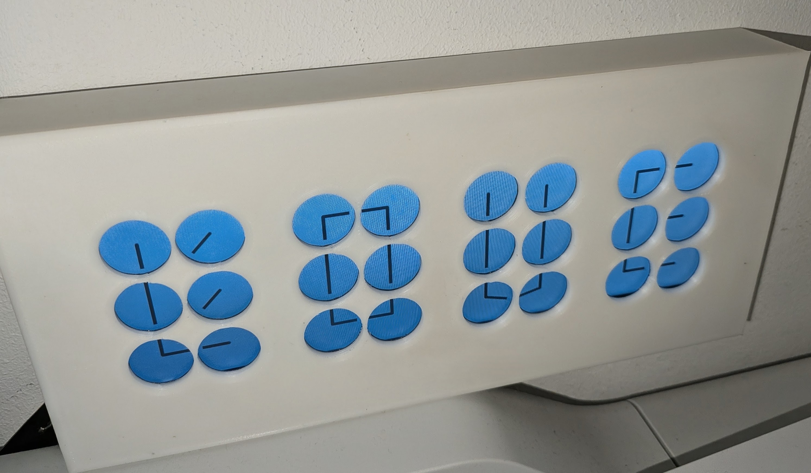
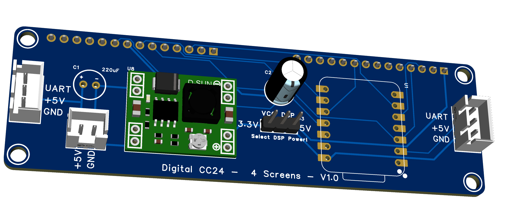

# digital_clock_clock_24_4_screens — a ClockClock 24 on four screens

Four 320×240 panels forming one [ClockClock 24](https://clockclock.com/),
driven by **2 XIAO ESP32-S3 boards with 2 panels each**. Every panel renders one
**digit** of `HH:MM` — six mini-clocks in a 2×3 block (`partial: {mode: digit}`)
— so four screens make the whole clock.

One board has Wi-Fi and SNTP and broadcasts the time over a one-wire UART bus;
the other listens. The master drives two panels too — it is board A, not a third
box.

**Much cheaper than the 24-round-screen build, at the cost of a gap between the
digits** — four screens cannot be one continuous field of clocks the way the
original is. See [Four screens vs
twenty-four](#four-screens-vs-twenty-four).



*A printed mock-up of the layout: four blocks of six, with a gap at every
digit boundary. That gap is the trade this build makes — see [Four screens vs
twenty-four](#four-screens-vs-twenty-four).*

> **Status:** builds and validates. Untested on hardware.

This is the small sibling of
[`digital_clock_clock_24_24_round_screens/`](../digital_clock_clock_24_24_round_screens),
which builds the same clock out of 24 individual round panels on 8 boards. The
two share a pin map, a carrier-PCB family and all of the sync machinery — that
README is the fuller reference for the
[protocol](../digital_clock_clock_24_24_round_screens/TECHNICAL.md#time-sync) and
[bus debugging](../digital_clock_clock_24_24_round_screens/TECHNICAL.md#debugging-the-bus).

### Four screens vs twenty-four

**This is the cheap way in.** Four panels and two boards instead of 24 panels
and eight — roughly a sixth of the displays, a quarter of the MCUs and a
quarter of the PCBs, with none of the mechanical work of mounting two dozen
modules in a frame. It runs the same engine and the same choreographies.

| | 4 screens | 24 round screens |
| --- | --- | --- |
| Panels | 4 × 320×240 rectangular | 24 × 240×240 round |
| Boards | 2 | 8 |
| A panel draws | one **digit** (6 clocks) | one **mini-clock** |
| Spacing | even inside a digit, **gap between digits** | even across all 24 |
| Look | close, but visibly four screens | one physical clock per module — the real thing |
| Effort | an afternoon | a project |

**The trade-off is the gaps.** On the real ClockClock 24 the 24 clocks sit on
one evenly spaced 8 × 3 grid, so `HH:MM` reads as a single continuous field of
clocks. Here each digit is its own panel, so the six clocks *within* a digit
are evenly spaced but every digit boundary carries the two screens' bezels
plus whatever gap the mounting leaves. You get four blocks of six rather than
one grid of 24 — the clock is unmistakably the same idea, but it does not
disappear into a single surface the way the original does.

Two things soften it if that matters to you:

- **Choose panels with thin bezels and butt them as close as the mounting
  allows.** The gap you cannot remove is the glass-to-glass distance; the rest
  is up to the frame.
- **`padding_inside`** (3 px here) sets the gutter *between* mini-clocks within
  a digit. Raising it makes the in-digit spacing more like the between-digit
  spacing, which trades absolute tightness for a more even overall rhythm.

The engine is identical; only `partial:` differs. That is the point of
`partial:` — the same 24-clock choreography is sliced whichever way the
hardware is built, so a choreography like `wave` still travels correctly across
all four screens.

## Wiring

```
        5 V ─────┬──────────────────────┬────────────
       GND ─────┼──┬───────────────────┼──┬─────────
                │  │                   │  │
   ┌────────────┴──┴───────┐   ┌───────┴──┴─────────┐
   │ BOARD A — MASTER      │   │ BOARD B            │
   │ XIAO ESP32-S3         │   │ XIAO ESP32-S3      │
   │ + 2 panels            │   │ + 2 panels         │
   │                       │   │                    │
   │ Wi-Fi + SNTP          │   │ no network         │
   │ digit 0  digit 1      │   │ digit 2   digit 3  │
   │  (HH tens / units)    │   │  (MM tens / units) │
   │                       │   │                    │
   │  D1 (GPIO2)  TX ●─────┼───┼──●  D1  RX         │
   │              GND ●────┼───┼──●  GND            │
   └───────────────────────┘   └────────────────────┘

        [ 0 ][ 1 ] : [ 2 ][ 3 ]      <- the four screens, left to right
```

**The bus is one wire plus ground**, master → slave only, so the slave needs
`RX` and nothing else. The same silkscreen pin — **D1** — on both boards, with
the role deciding direction.

### Per-board pin budget

| Pin | GPIO | Used by | Note |
| --- | --- | --- | --- |
| D0 | 1 | free | |
| **D1** | **2** | **sync UART** | clean: no strapping function, no ROM UART |
| D2 | 3 | LCD reset — **shared by both panels** | also a strapping pin (JTAG source select); fine as a reset output, don't hold it low at boot |
| D3 | 4 | LCD DC — **shared by both panels** | |
| D4 | 5 | screen A chip select | |
| D5 | 6 | screen B chip select | |
| D6 | 43 | free | the ROM's UART0 TX — see below |
| D7 | 44 | free | the ROM's UART0 RX |
| D8 | 7 | SPI SCK | |
| D9 | 8 | SPI MISO | routed here, unlike the round board |
| D10 | 9 | SPI MOSI | |

**The sync bus must not sit on D6.** GPIO43 is the ROM's UART0 TX, and every S3
drives it as a push-pull output for the first ~200 ms of a boot, before ESPHome
reconfigures the pin. A slave with the bus there would be fighting the master's
TX driver on every power-up — output against output, on the one wire the whole
clock depends on. Keep `logger:` on the USB CDC console (the configs do) so it
never contends either.

## The PCB

A carrier board that takes a XIAO ESP32-S3, breaks out two 14-pin display
headers, regulates the panel supply and passes the sync bus and 5 V through to
the other board. Design files are in [`PCB/`](https://github.com/tuct/esphome-lvgl-clock/tree/main/digital_clock_clock_24_4_screens/PCB): EasyEDA Pro v1.0,
**98.3 × 29.7 mm**, 2 layers.



| File | What it is |
| --- | --- |
| [`3D_PCB2_2026-08-16.png`](./PCB/3D_PCB2_2026-08-16.png) | 3D render |
| [`SCH_Schematic1_4screen_1-P1_2026-08-16.png`](./PCB/SCH_Schematic1_4screen_1-P1_2026-08-16.png) | Schematic |
| [`Gerber_PCB2_2026-08-16.zip`](./PCB/Gerber_PCB2_2026-08-16.zip) | Gerbers + drills, ready to upload |
| [`Netlist_Schematic1_4screen_2026-08-16.tel`](./PCB/Netlist_Schematic1_4screen_2026-08-16.tel) | Netlist |

Upload the gerber zip as-is to JLCPCB or any EasyEDA-compatible fab — 2-layer,
1.6 mm, nothing special.

### What is on it

| Ref | Part | Role |
| --- | --- | --- |
| U1 | Seeed XIAO ESP32-S3 (DIP) | The MCU, on a 2×7 socket |
| U2 / U5 | 14-pin female headers | `SCREEN A` / `SCREEN B` |
| U3 | 3-pin male header | **Panel voltage jumper** — see below |
| U8 | MP1584EN module | 5 V → 3.3 V |
| U7 | JST-XH 2-pin | 5 V power in |
| CN1 / CN2 | JST-XH 3-pin | Sync bus + 5 V, in and out |
| C1 | 220 µF | Bulk on the 5 V rail |
| C2 | 100 µF | Bulk on the 3.3 V rail |
| C3, C4 | 100 nF 0805 | Decoupling, one per screen header |

### The panel voltage jumper (U3)

The middle pin is `VCC_DSP` — what the two panels actually run on. The outer
pins are **+3.3 V** (from the MP1584) and **+5 V**. Jumper one side:

- **3.3 V** if your ILI9342 modules have no on-board regulator.
- **5 V** if they do — most 2.4″/2.8″ modules with a `VCC` marked 5 V regulate
  down themselves.

Get this wrong towards 5 V on a 3.3 V-only module and you will damage it.
**Check the module before fitting the jumper**, and set the MP1584 to 3.3 V with
the headers empty either way — these modules ship adjustable and usually well
above 3.3 V.

### Screen header pinout

`VCC_DSP, GND, CS, RESET, DC, SDA_MOSI, SCL, BLK/3.3V, SDO_MISO` on pins 1–9;
pins 10–14 are the modules' touch lines and are left unconnected. Both screens
share clock, data, MISO, reset and DC, and differ only in chip select — which
is what makes two panels cost two pins instead of ten.

**The backlight is not dimmable.** Pin 8 (`BLK`) is tied to +3.3 V, so the
panels are always at full brightness. Nothing in the config pretends otherwise
— there is no `light:` here — but it is worth knowing before you look for a
brightness control.

### The PCB is where the pin map comes from

Every net matches
[`common_base_esp32_s3_xiao.yaml`](./common_base_esp32_s3_xiao.yaml) — the
board is the authority and the YAML follows it. These are the **same
assignments the 24-round-screen carrier uses**, so the two PCB builds share one
pin map:

| PCB net | XIAO pin | YAML substitution |
| --- | --- | --- |
| `UART` | D1 | `sync_pin` |
| `RESET` | D2 | `reset_pin` |
| `DC` | D3 | `dc_pin` |
| `CS_A` | D4 | `cs_pin_a` |
| `CS_B` | D5 | `cs_pin_b` |
| `SCL` (SCK) | D8 | `clk_pin` |
| `SDO_MISO` | D9 | `miso_pin` |
| `SDA_MOSI` | D10 | `mosi_pin` |

## Which digit is which

```
        screen 0     screen 1        screen 2     screen 3
        (HH tens)    (HH units)      (MM tens)    (MM units)
       ┌──────────┬────────────┐    ┌──────────┬────────────┐
 row 0 │  0    1  │   6    7   │    │  12  13  │  18   19   │
 row 1 │  2    3  │   8    9   │    │  14  15  │  20   21   │
 row 2 │  4    5  │  10   11   │    │  16  17  │  22   23   │
       └──────────┴────────────┘    └──────────┴────────────┘
            BOARD A                       BOARD B
```

`partial: {mode: digit, index: N}` draws digit `N`'s six clocks, filling the
panel. The mini-clock numbering underneath is the same `index = digit * 6 +
cell` grid the 24-screen build uses, which is why a choreography spanning all
8 wall columns lines up across four screens exactly as it does across 24.

Every panel prints its own position at boot, so a mis-wired screen is one log
line away:

```
[C][lvgl_clock]:   Partial: digit 0 of 4
```

## Time sync and choreographies

Identical to the 24-screen build — the master broadcasts
`CC24 <epoch> <ms> <mode> …` once a second and on every mode change, and the
slave sets its clock and mirrors the mode. Every field after `<mode>` is
optional, so the line has grown over time (temperature, pattern slot,
movement, sweep length, choreography speed) without ever breaking a board
running older firmware. The
[protocol section there](../digital_clock_clock_24_24_round_screens/TECHNICAL.md#time-sync)
covers it in full. Two things that matter when wiring this one up:

- **Only the master runs the boot-phase `interval:`** (spin → birds → time).
  The slave has none: the mode arrives over the bus, so a board that also
  decided for itself would fight the master once a second.
- **Both widgets must be listed** in the slave's `lvgl_clock_id`. The bus is
  the only thing that sets their mode, so one left out would sit on the boot
  default forever:

  ```yaml
  lvgl_clock_id: [dc_a, dc_b]
  ```

`panel.yaml` steps the clock through its choreographies — `birds`, `wave`,
`spiral`, `wind`, `love` — one per minute, each running from **:10 to :45**. The list is
walked in order and wraps; repeat an entry to show it more often. The choice is
made by `dc_a` on board A alone and travels over the bus, so all four screens
run the same one. `wave` is the useful one for checking the build: its crest is
defined to travel left to right across all 8 wall columns, so if screen 2 shows
the phase screen 1 should, the digits are assigned wrongly.

## Only the master has a network

`wifi:` and `ota:` live in `board_a.yaml` alone. Board B takes the time off the
UART and has no network stack, so there is one set of credentials and one board
that cares whether Wi-Fi is up. The cost is that **board B is flashed over
USB** — an easier trade here than on the 24-screen build, since there is only
one of it.

## Files

| File | What it is |
| --- | --- |
| `common_base_esp32_s3_xiao.yaml` | Board, PSRAM, logger, pin map, colours. **No network** — that lives in `board_a.yaml` |
| `common.yaml` | The two displays, and the panel includes |
| `panel.yaml` | One panel's LVGL instance and digit widget — included twice with `vars:` |
| `common_slave.yaml` | The listener half: UART RX, the `lvgl_clock` time platform, the hostname |
| `board_a.yaml` | **The master.** Wi-Fi, SNTP, UART TX, the boot-phase animation, digits 0 + 1 |
| `board_b.yaml` | The listener — digits 2 + 3. Four lines |
| `board_a_hand.yaml` / `board_b_hand.yaml` | The same two boards for an older hand-wired prototype rather than the PCB — they include the files above and override the four pins that differ (`pinout_hand.yaml`). Ignore these if you built the board. |
| `secrets.yaml.example` | Copy to `secrets.yaml` (gitignored). Only `board_a.yaml` reads it |

Board B is deliberately nothing but its half of the clock:

```yaml
packages:
  slave: !include common_slave.yaml

substitutions:
  clock_digit_a: "2"
  clock_digit_b: "3"
```

## Flashing

```bash
esphome run board_a.yaml      # master — over the network once it is on Wi-Fi
esphome run board_b.yaml      # listener — over USB
```

Copy `secrets.yaml.example` to `secrets.yaml` first.

## Bring-up order

`clock_mode` is a **master-only** knob — the master owns the mode and board B
follows whatever it broadcasts.

1. Flash **board A in demo**, bus unplugged:

   ```bash
   esphome -s clock_mode demo run board_a.yaml
   ```

   The fake minute advances every 5 s, so digit flips can be watched without
   waiting on real time. Confirm both panels are alive and the right way up
   during the 10 s `startup_align`. Note that in demo only digit 3 changes on
   every tick — that is board B's screen — so on board A alone expect digit 1
   to move every 5 minutes. Add `-s ...` for a minutes digit if you want
   something livelier.
2. Flash **board B**, wire A's D1 to B's D1 plus common ground, and power both.
   B's sync dots should go dark within a second of A coming up, and the four
   screens should count the same fake minute **with the network unplugged** —
   which proves the bus, the mode mirroring and the demo-minute propagation in
   one step.
3. Reflash the master without `-s clock_mode demo` and watch the boot phase:
   all four screens should spin together, switch to birds together once Wi-Fi
   is up, land on the real time together, then break into a shared
   choreography at `:10`.

## Power

Not measured on this build. The
[24-round-screen version](../digital_clock_clock_24_24_round_screens/TECHNICAL.md#power)
draws
~150 mA per board for three 240×240 panels; two 320×240 panels are a similar
total area, so expect the same order and **measure before sizing a supply**.
Size for inrush rather than the average — panels striking and the master
associating to Wi-Fi both land at switch-on.

## Rough BOM

- 2 × Custom PCB (see [`PCB/`](https://github.com/tuct/esphome-lvgl-clock/tree/main/digital_clock_clock_24_4_screens/PCB))
- 2 × Seeed XIAO ESP32-S3
- 2 × MP1584EN module
- 4 × 4.0″ 320×240 ILI9342 SPI panel, 14-pin header
- 2 × JST-XH 2-pin, 4 × JST-XH 3-pin (+ matching housings)
- 2 × 2.54 mm jumper for U3
- Two wires (D1 + GND) between the boards

ILI9488 Touch SN Display SPI, LCD Drawing Modules, 4 in TFT LCD Display Module ILI9488 Driver 14 Pin 480 x 320 HD SPI Serial Touch SN Display Module
https://amzn.to/4zu2V9h
about €30 per panel on amazon
about 1/2 or lower on aliexpress, i used touch versions, but no touch should also work