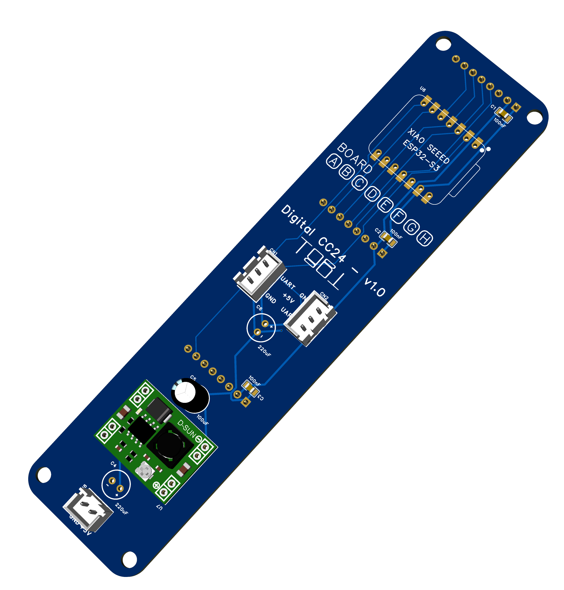

# digital_clock_clock_24 — a physical ClockClock 24, on 24 round screens

24 round displays forming one [ClockClock 24](https://clockclock.com/), driven
by **8 XIAO ESP32-S3 boards with 3 panels each**. Every board runs the same
[`lvgl_clock`](../../README.md) `clockclock24` engine, and each panel renders
**one** of the 24 mini-clocks (`partial: 0…23`), so the digit sweeps,
`movement:` directions and idle animations stay identical across the wall by
construction.

One board has Wi-Fi and SNTP and broadcasts the time over a one-wire UART bus;
the other seven listen. The master drives three panels too — it is board A, not
a ninth box.

> **Status:** builds and validates. Untested on hardware beyond a bring-up pair.

### Why three panels per board, and not one

This build used to be one XIAO ESP32-C3 per mini-clock — 24 boards, 24 power
feeds, 24 drops on the sync bus. Three panels on one S3 collapses that to 8 of
each, and the S3 has the PSRAM to make it free: the panels share one SPI bus,
one DC line and one reset line, so each extra panel costs a single chip select.

**One board is one physical column of the wall.** The wall is 8 columns × 3
rows and a board drives 3 panels, so the split falls out for free: board A is
column 0, board H is column 7, and each board's three panels are simply that
column top to bottom. Nothing crosses a column boundary, so the panel cables
stay short and a board can be pulled out of the frame as a unit.

The trade is that a board is now a failure domain of three clocks rather than
one, and the three panels share ~34 ms of bus time per full frame (see
`render_interval` below).

## Wiring

```
        5 V ─────┬──────────────┬──────────────┬─────────────  … to all 8
       GND ─────┼──┬───────────┼──┬───────────┼──┬──────────  … to all 8
                │  │           │  │           │  │
   ┌────────────┴──┴───────┐ ┌─┴──┴──────────┐ ┌─┴──┴──────────┐
   │ BOARD A — MASTER      │ │ BOARD B       │ │ BOARD C … H   │
   │ XIAO ESP32-S3         │ │ XIAO ESP32-S3 │ │ XIAO ESP32-S3 │
   │ + 3 round panels      │ │ + 3 panels    │ │ + 3 panels    │
   │ wall column 0         │ │ wall column 1 │ │ columns 2…7   │
   │                       │ │               │ │               │
   │ Wi-Fi + SNTP          │ │ no network    │ │ no network    │
   │ partial: 0 / 2 / 4    │ │ partial:      │ │ partial:      │
   │                       │ │  1 / 3 / 5    │ │  see table    │
   │  D1 (GPIO2)  TX ●─────┼─┼──●  D1  RX    │ │  ●  D1  RX    │
   │              GND ●────┼─┼──●  GND       │ │  ●  GND       │
   └───────────────────│───┘ └───────────────┘ └───────────────┘
                       │              ▲                ▲
                       └──────────────┴────────────────┘
                          one TX wire, fanned out to
                          all 7 slave RX pins + common GND
```

**The bus is one wire plus ground**, master → slaves only, so slaves need `RX`
and nothing else. The same silkscreen pin — **D1** — on every board, with the
role deciding direction. One TX output driving 7 CMOS inputs is comfortable on
a bench at 115200 baud; across a real frame with metres of cable, use RS-485
transceivers and keep the star tight.

### Per-board pin budget (XIAO ESP32-S3 + 3 × GC9A01A)

| Pin | GPIO | Used by | Note |
| --- | --- | --- | --- |
| D0 | 1 | free | |
| **D1** | **2** | **sync UART** | clean: no strapping function, no ROM UART |
| D2 | 3 | LCD reset — **shared by all three panels** | also a strapping pin (JTAG source select); fine as a reset output, don't hold it low at boot |
| D3 | 4 | LCD DC — **shared by all three panels** | |
| D4 | 5 | panel A chip select | |
| D5 | 6 | panel B chip select | |
| D6 | 43 | panel C chip select | also the ROM's UART0 TX — see below |
| D7 | 44 | backlight (all three) | also the ROM's UART0 RX (an input at boot, so nothing contends) |
| D8 | 7 | SPI SCK | |
| D9 | 8 | SPI MISO | |
| D10 | 9 | SPI MOSI | |

### Why the sync bus must not sit on D6

**D6/GPIO43 is the ROM's UART0 TX**, and every S3 drives it as a push-pull
output for the first ~200 ms of a boot, before ESPHome reconfigures the pin. A
slave with the bus on D6 would be fighting the master's TX driver on every
power-up — output against output, on the one wire the whole wall depends on.
That is exactly the "board comes up, never shows time" symptom.

As **panel C's chip select** the same pin is harmless: the boot chatter only
strobes CS while the panels are still held in reset, and they are initialised
from scratch afterwards.

Keep `logger:` on the USB CDC console (the configs do) so it never contends
with the sync UART either.

## The PCB

A carrier board — one per wall column — that takes a XIAO ESP32-S3, breaks out
the three panel headers, regulates the panel supply and passes the sync bus and
5 V through to the next board. Design files are in [`PCB/`](./PCB): EasyEDA Pro
v1.0, **34 × 140 mm**, 2 layers.



| File | What it is |
| --- | --- |
| [`3D_PCB3_2026-08-16.png`](./PCB/3D_PCB3_2026-08-16.png) | 3D render (right) |
| [`SCH_Schematic3_1-P1_2026-08-16.png`](./PCB/SCH_Schematic3_1-P1_2026-08-16.png) | Schematic |
| [`Gerber_PCB3_2026-08-16.zip`](./PCB/Gerber_PCB3_2026-08-16.zip) | Gerbers + drills, ready to upload |
| [`Netlist_Schematic3_2026-08-16.tel`](./PCB/Netlist_Schematic3_2026-08-16.tel) | Netlist |

Upload the gerber zip as-is to JLCPCB or any EasyEDA-compatible fab — 2-layer,
1.6 mm, no controlled impedance or other special process. The silkscreen has a
**`BOARD A B C D E F G H`** row: tick the board's letter as you build it, so a
mis-indexed board is identifiable without reading its logs.

### What is on it

| Ref | Part | Role |
| --- | --- | --- |
| U6 | Seeed XIAO ESP32-S3 (DIP) | The MCU, on a 2×7 socket |
| U3 / U4 / U5 | 8-pin female headers | Panels A / B / C |
| U7 | MP1584EN module | 5 V → 3.3 V for the panels |
| U8 | JST-XH 2-pin | 5 V power in |
| CN1 / CN2 | JST-XH 3-pin | Sync bus + 5 V, in and out |
| C1–C3 | 100 nF 0805 | Decoupling, one per panel header |
| C4, C6 | 220 µF | Bulk on the 5 V rail |
| C5 | 100 µF | Bulk on the 3.3 V rail |

### Power topology

5 V arrives on **U8** and goes two places: straight to the XIAO's `VBUS` pin
(which runs its own on-board regulator for the MCU), and into the **MP1584**,
which steps it down to **3.3 V for the three panels**. The panels are not run
off the XIAO's regulator — three GC9A01As would be well past what it can
supply.

> **Set the MP1584 to 3.3 V before fitting the panels.** These modules ship
> adjustable and are usually set well above 3.3 V out of the box. Power the
> board with the panel headers empty, turn the trimmer until the header's
> pin 2 reads 3.3 V, then fit the panels. Getting this wrong once costs three
> displays.

**CN1 and CN2 are the same three nets** (`UART`, `+5 V`, `GND`), so a board can
be looped through to the next one. For the sync bus that is fine — it is one TX
driving high-impedance inputs. For **power it is not**: at 1.2 A total, daisy-
chaining drops enough that the last board sees noticeably less than 5 V. Feed
power in a star from one point and use the second connector only for the bus,
or accept short chains of two or three boards at most.

### The PCB is where the pin map comes from

Every net on the board matches the substitutions in
[`common_base_esp32_s3_xiao.yaml`](./common_base_esp32_s3_xiao.yaml) — this is
the authority, and the YAML follows it:

| PCB net | XIAO pin | YAML substitution |
| --- | --- | --- |
| `UART` | D1 | `sync_pin` |
| `RESET` | D2 | `reset_pin` |
| `DC` | D3 | `dc_pin` |
| `CS_A` | D4 | `cs_pin_a` |
| `CS_B` | D5 | `cs_pin_b` |
| `CS_C` | D6 | `cs_pin_c` |
| `SCL` (SCK) | D8 | `clk_pin` |
| `SDA_MOSI` | D10 | `mosi_pin` |

The panel headers carry `GND, 3V3, SCL, SDA, RESET, DC, CS, BLK` on pins 1–8,
so all three share the clock, data, reset and DC lines and differ only in their
chip select — which is what makes three panels cost three pins instead of
twelve.

### Two things v1.0 does not wire

Both are harmless, but the YAML currently describes hardware that is not there:

- **The backlight is not dimmable.** Panel pin 8 (`BLK`) is tied straight to
  +3.3 V, and **D7 is a no-connect** on the schematic. So the `output:` +
  `light:` pair in `common.yaml` builds and exposes a `backlight` entity that
  controls nothing — the panels are simply always on. (This also means the
  "dim the wall to halve its draw" trick under [Power](#power) needs a v1.1
  that routes D7 to `BLK`.)
- **MISO is not routed.** `D9` is a no-connect too. `miso_pin: D9` is still
  declared on the `spi:` bus, which costs nothing — these panels are
  write-only and the pin is unused elsewhere — but nothing is on the other end
  of it.

Say the word and I will drop the `light:` and the `miso_pin:` from the configs;
they are left in for now so a v1.1 that routes both needs no YAML change.

## How the 24 clocks are numbered

Each digit of `HH:MM` is a 2-wide × 3-tall block of mini-clocks, so the wall is
8 columns × 3 rows. Numbering runs left-to-right then top-to-bottom **within** a
digit, and the digits go left to right:

```
          digit 0      digit 1      digit 2      digit 3
          (HH tens)    (HH units)   (MM tens)    (MM units)
        ┌──────────┬────────────┬────────────┬────────────┐
 row 0  │  0    1  │   6    7   │  12   13   │  18   19   │
 row 1  │  2    3  │   8    9   │  14   15   │  20   21   │
 row 2  │  4    5  │  10   11   │  16   17   │  22   23   │
        └──────────┴────────────┴────────────┴────────────┘
```

```
index = digit * 6 + cell        cell = row * 2 + col
```

and back the other way:

```
digit = index / 6      row = (index % 6) / 2      col = (index % 6) % 2
wall column = digit * 2 + col
```

### Board → column → clocks

One board per column, so a board's three indices step by **2**, not by 1:

| Board | Wall column | Digit | Clocks (rows 0/1/2) | Role |
| --- | --- | --- | --- | --- |
| **A** | 0 | hours tens, left | **0 / 2 / 4** | **master** — Wi-Fi + SNTP |
| B | 1 | hours tens, right | 1 / 3 / 5 | listener |
| C | 2 | hours units, left | 6 / 8 / 10 | listener |
| D | 3 | hours units, right | 7 / 9 / 11 | listener |
| E | 4 | minutes tens, left | 12 / 14 / 16 | listener |
| F | 5 | minutes tens, right | 13 / 15 / 17 | listener |
| G | 6 | minutes units, left | 18 / 20 / 22 | listener |
| H | 7 | minutes units, right | 19 / 21 / 23 | listener |

Laid over the grid, each board owns one vertical stripe:

```
         A    B      C    D      E    F      G    H
        ┌────────┐ ┌────────┐ ┌────────┐ ┌────────┐
 row 0  │ 0    1 │ │ 6    7 │ │ 12  13 │ │ 18  19 │
 row 1  │ 2    3 │ │ 8    9 │ │ 14  15 │ │ 20  21 │
 row 2  │ 4    5 │ │ 10  11 │ │ 16  17 │ │ 22  23 │
        └────────┘ └────────┘ └────────┘ └────────┘
```

Every panel prints its own position at boot, so a mis-wired module is one log
line away:

```
[C][lvgl_clock]:   Partial: clock 18 of 24 (digit 3, row 0, col 0)
```

Label every panel on the back as you build it — a mis-indexed panel is
invisible until its digit happens to change.

### Which clocks move, and how often

Worth knowing before you conclude a panel is dead. In `mode: demo` the fake
clock advances one minute every `demo_interval` (5 s), so:

| index | digit | changes every |
| --- | --- | --- |
| 18–23 | minutes, units | **5 s** |
| 12–17 | minutes, tens | 50 s |
| 6–11 | hours, units | 5 min |
| 0–5 | hours, tens | 50 min |

So the boards worth watching on the bench are **G and H** (the minutes-units
numeral, clocks 18–23): all six move on every demo tick, and any sync error
between the two shows up as a single digit visibly forming in two stages.

Board A, the master, is the *hours-tens* column, which only changes every 50
minutes in demo. For bring-up either borrow a minutes column,

```bash
esphome -s clock_index_a 19 -s clock_index_b 21 -s clock_index_c 23 \
        run board_a.yaml
```

or raise `demo_step:` (fake minutes per tick, default 1) in `common.yaml` —
e.g. `137` changes all four digits every tick.

## Time sync

The master broadcasts a line on the bus (default every second):

```
CC24 <epoch> <ms> <mode> <demo_min>\n
```

`<ms>` is the part that matters. Nodes only need to agree on which *minute* it
is, but a node whose clock sits a second off flips its digit a second late, and
on a wall of 24 that reads as a fault rather than as drift. ESPHome's own
`synchronize_epoch_()` deliberately ignores corrections under ±1 s and sets
whole seconds only, so the slave platform sets its clock with microsecond
precision instead and flips land within transport jitter. `<mode>` carries
`time` / `rotate_left` / `flying_birds` / `demo` so the whole wall animates as
one, and `<demo_min>` carries the master's fake-minute counter in demo mode
(-1 otherwise) — without it each board would count its own and the wall would
show 8 different times.

### Only the master runs the boot-phase animation

`board_a.yaml` has the `interval:` that spins while connecting, flies birds
while waiting for NTP, then shows the time. The slaves deliberately have none:
the mode rides the sync packet, so a slave that also decided for itself would
fight the master once a second.

**There is no separate command channel, and there doesn't need to be** — the
mode *is* field 3 of the packet, and a slave applies it to every widget it
lists. What makes the boot phase work is the `<epoch> == 0` case: the master
starts broadcasting the moment it boots, before SNTP has given it a time, and
sends

```
CC24 0 0 1 -1        # no time yet, mode = rotate_left
```

A slave reads epoch 0 as "mode only — keep your clock", so it spins with the
master from the first second. Without that the master would broadcast nothing
until NTP landed, and the wall would spend its whole boot phase with one column
spinning and seven sitting on the boot default with nothing to follow.

It is also what lets **demo mode** run the whole wall **with no network at
all**: `<demo_min>` rides the same mode-only packet, so all eight boards count
the same fake minute straight off the bench supply.

### Choreographies, and why they need no coordination

`common.yaml` sets the wall to break out into an animation from **:10 to :45**
of every minute:

```yaml
cycle_modes:
  interval: 1min
  # The 35s window, starting 10s past the minute so it stays clear of the
  # digit flip at :00, is fixed in the component - only the cadence is a knob.
  modes: [birds, wave, spiral, wind]
```

Each animation is a pure function of the synced clock and the mini-clock's
position in the 8×3 grid, so once two boards agree on the mode and the time
they are drawing the same frame of the same figure.

The list is walked **in order** and wraps, so a repeated entry comes round more
often. **Which** choreography plays is decided in exactly one place: `dc_a` on board A,
the first widget listed in that board's `lvgl_clock_id`. Everything else — board
A's other two panels included — is marked a follower, never runs
`cycle_modes:`, and is handed the mode in the sync packet. Letting all eight
boards pick for themselves would hold only as long as their clocks and their
config agreed to the second; one board a second out at :10 would start a
different animation from the other seven. So `cycle_modes:` stays in the shared
`common.yaml` and only the master acts on it.

A board that reboots at :25 is handed the running choreography within a second
and joins it mid-figure, rather than starting its own.

`wave` is the one that proves the wiring: the crest is defined to travel left
to right across all 8 columns, so if board E is showing the phase board D
should be, it is mis-indexed. A column-per-board layout makes that obvious.

The animations also run off the wall clock rather than `millis()`, which is
what makes any of this work — `millis()` starts at each board's own power-on.

That means a slave's `lvgl_clock_id` must list **all three** of its widgets:

```yaml
lvgl_clock_id: [dc_a, dc_b, dc_c]
```

The bus is the only thing that moves them, so one left out would sit on the
boot default forever.

### Debugging the bus

Both roles log it. `logger: level: DEBUG` gets you a throttled health line
every 10 s from either end; `lvgl_clock.sync: VERBOSE` adds every packet:

```yaml
logger:
  level: DEBUG
  logs:
    lvgl_clock.sync: VERBOSE
```

The three states worth recognising:

| Log line | Means |
| --- | --- |
| `TX mode-only (…, no system time yet)` | the master is broadcasting, but has no SNTP — the wall will animate together and show no time |
| `RX no valid packets yet (0 bytes, …)` | nothing is arriving: wiring, ground, or the master is silent |
| `RX bad prefix, ignored: '…'` / `RX overlong line` | bytes are arriving but garbled: baud mismatch or signal integrity |
| `RX stalled: last packet … ms ago` | the bus was working and stopped: master rebooted, or a wire came off |

### The sync dot — reading the wall without a laptop

`sync_dot: true` puts a dot at 1:30 on each panel that flashes for 120 ms every
second **while that board is out of sync**. It is a fault light, not a
heartbeat:

| What you see | What it means |
| --- | --- |
| No dots anywhere | The whole wall is synced. This is the healthy state |
| Every slave blinking, master clean | The master has no usable time yet, or its TX is dead |
| One column blinking | That board's RX drop, or its ground |
| Dots come back after working | The bus went quiet for 10 s — the board is now free-running and will drift |

The master never shows a dot: it is the time source, so it has nothing to be
out of sync with. That falls out of the default rather than being wired up —
a widget is "synced" unless a listening time platform tells it otherwise, so a
standalone clock never shows one either.

The blinking panels blink *together*, since the dot is driven off the shared
clock. A whole column coming up at once therefore reads as "the master is
late", while one odd panel in a column reads as "that node's wiring".

## Only the master has a network

`wifi:`, `api:` and `ota:` live in `board_a.yaml` alone. Boards B–H take the
time off the UART and have no network stack at all, which means:

- **One set of credentials on the wall**, and one board that cares whether the
  Wi-Fi is up. Seven boards that cannot fail to associate, cannot wait on DHCP,
  and boot to a spinning clock in a second.
- **No OTA on the listeners.** They are flashed over USB. With eight boards
  rather than 24 that is a much easier trade than it used to be, but it is the
  real cost — decide before the frame is glued shut.
- Their heap sensors still report to the USB console via `logger:`; they just
  have nowhere to publish.

If you would rather have OTA on all eight, add `wifi:` and `ota:` (and skip
`api:`) to `common_base_esp32_s3_xiao.yaml` instead — nothing else changes,
because the time still comes off the bus either way.

## Memory

The S3's 8 MB of octal PSRAM is what makes three panels per board unremarkable.
`direct_draw: true` also skips the widget's own canvas and renders straight
into LVGL's buffer — a 240×240 RGB565 canvas is 115 KB, so three of them would
have been 345 KB that the build simply never allocates.

The base package enables the memory debug sensors (`free`, `block`). Watch
`block`: a draw buffer needs one contiguous chunk, so it can fail while `free`
still looks fine. If a widget runs out it logs an error and disables itself — a
blank panel rather than a crash.

### Frame rate

Each 240×240 panel needs ~11.5 ms for a full frame at 80 MHz, and all three
share one SPI bus, so ~34 ms is the floor for a full sweep. `render_interval:
33ms` (≈30 fps) matches that; asking for 60 just starves the next frame.

## Files

| File | What it is |
| --- | --- |
| `common_base_esp32_s3_xiao.yaml` | Board, PSRAM, logger, pin substitutions, colours, heap sensors. **No network** — that lives in `board_a.yaml` |
| `common.yaml` | The three panels, three LVGL instances and three `lvgl_clock` widgets with `partial: ${clock_index_*}` |
| `common_slave.yaml` | The listener half: UART RX, the `lvgl_clock` time platform, and the hostname |
| `board_a.yaml` | **The master.** Wi-Fi, SNTP, UART TX, the boot-phase animation, clocks 0/2/4 |
| `board_b.yaml` … `board_h.yaml` | The seven listeners. Each is four lines: an include and its three clock indices |
| `secrets.yaml.example` | Copy to `secrets.yaml` (gitignored). Only `board_a.yaml` reads it |

A listener board file is deliberately nothing but its column:

```yaml
packages:
  slave: !include common_slave.yaml

substitutions:
  clock_index_a: "1"
  clock_index_b: "3"
  clock_index_c: "5"
```

The hostname comes from `common_slave.yaml` as `cc24-clock-${clock_index_a}`,
so even that doesn't have to be repeated per board.

## Flashing

```bash
esphome run board_a.yaml      # master, over the network once it is on Wi-Fi
esphome run board_b.yaml      # …through board_h.yaml, over USB
```

Only board A has `ota:`, so the seven listeners are flashed over USB. That is
the deliberate trade for having no Wi-Fi stack on them — see below.

Each board gets its own hostname and build directory, so the eight builds don't
collide.

## Bring-up order

`clock_mode` is a **master-only** knob — it lives in `board_a.yaml`, because the
master owns the wall's mode and the other seven follow whatever it broadcasts.
There is nothing to set on a slave, and nothing to keep in step by hand.

1. Flash **board G** on its own, no bus attached. It has no network and no
   master, so it will sit on the boot default showing an unset clock — which is
   exactly what you want for the first check: confirm all three panels light,
   are the right way up, and sweep to 12 together during the 10 s
   `startup_align`. Check the heap sensors while you are there.
2. Flash **board A as the master in demo**, borrowing board H's column so it
   has something that moves on every tick:

   ```bash
   esphome -s clock_mode demo \
           -s clock_index_a 19 -s clock_index_b 21 -s clock_index_c 23 \
           run board_a.yaml
   ```

   Wire A's D1 to G's D1 plus common ground. **Set demo on the master only** —
   G adopts it off the bus, minute counter included. The two boards should then
   count the same fake minute **with the network unplugged**, which proves the
   bus, the mode mirroring and the mode-only packet in one step. G's sync dots
   should go dark within a second of A coming up.
3. Reflash the master without `-s clock_mode demo` and watch the boot phase:
   all six clocks should spin together, switch to birds together once Wi-Fi is
   up, and land on the real time together — then break into a shared
   choreography at `:10`. This is the genuinely unproven part of the design;
   prove it before building six more boards.
4. Scale to 8 boards, A back in its own column 0.

## Power

**A board draws about 150 mA at 5 V** — one XIAO ESP32-S3 plus its three
panels with backlights on. That scales linearly, because every board is
identical:

| | Current at 5 V | Power |
| --- | --- | --- |
| One board (3 panels) | ~150 mA | ~0.75 W |
| Full wall, 8 boards | **~1.2 A** | ~6 W |
| Supply | 2 A USB | ~40% headroom |

So a 2 A USB supply carries the whole wall with room to spare, and each
MP1584EN is regulating ~150 mA — a fraction of what the module is rated for, so
they run cool and need no heatsinking.

Worth knowing before wiring it:

- **Size for inrush, not the average.** All eight boards come up together, and
  24 backlights striking at once plus the master associating to Wi-Fi pulls
  well above the steady 1.2 A for a few hundred milliseconds. 2 A covers it;
  a 1 A supply would brown out at switch-on and present as "a random board
  won't boot", which is a power fault wearing a firmware costume.
- **The master draws more than the slaves.** It is the only board running a
  Wi-Fi stack, worth roughly 50–80 mA extra in bursts. If anything is marginal,
  it fails there first.
- **Star the power, don't daisy-chain it.** At 1.2 A total, thin wire looped
  board to board drops enough that the last board sees noticeably less than
  5 V. Run pairs out from one point — same topology as the sync bus.
- **The backlight is not dimmable on PCB v1.0.** `BLK` is tied to +3.3 V, so
  the panels are always at full brightness and the `backlight` entity does
  nothing — see [Two things v1.0 does not
  wire](#two-things-v10-does-not-wire). Dimming would be the obvious way to cut
  the wall's draw, since the panels are most of it, but it needs a board revision
  that routes D7 to `BLK`.

## Rough BOM

-  8 × Custom PCB
-  8 × Seeed XIAO ESP32-S3
-  8 × MP1584EN Module
- 24 × 1.28″ 240×240 round GC9A01A panel
- 14 × JST-XH 3Pin Female 
- 14 × JST-XH 3Pin Male
- 24 × 8 Pinheader (screens)
- 16 × 7 Pinheader (esp32)
- Wires 
- 5 V supply — USB, 2 A (2000 mA); see Power above


1.28″ 240×240 round GC9A01A panel
5 pack of screens: 24 screens needed
https://amzn.to/4xJpK79
€23.49 as of 16.08.2026
=> about €115


Seeed XIAO ESP32-S3
https://amzn.to/4zm4KF8 €15.16 / per unit
or at www.seeedstudio.com, same for 3! from original seeed store!
=> about € 120 or 50 on seeed store
https://www.seeedstudio.com/Seeed-Studio-XIAO-ESP32S3-3PCS-p-5919.html about €15 for 3 + shipping 

MP1584EN module
https://amzn.to/4g2qbn7 €10 for 10 pack

JST-XH Connectors and crimping stuff

20-30€ for pcbs

About €200 to €300 total costs
