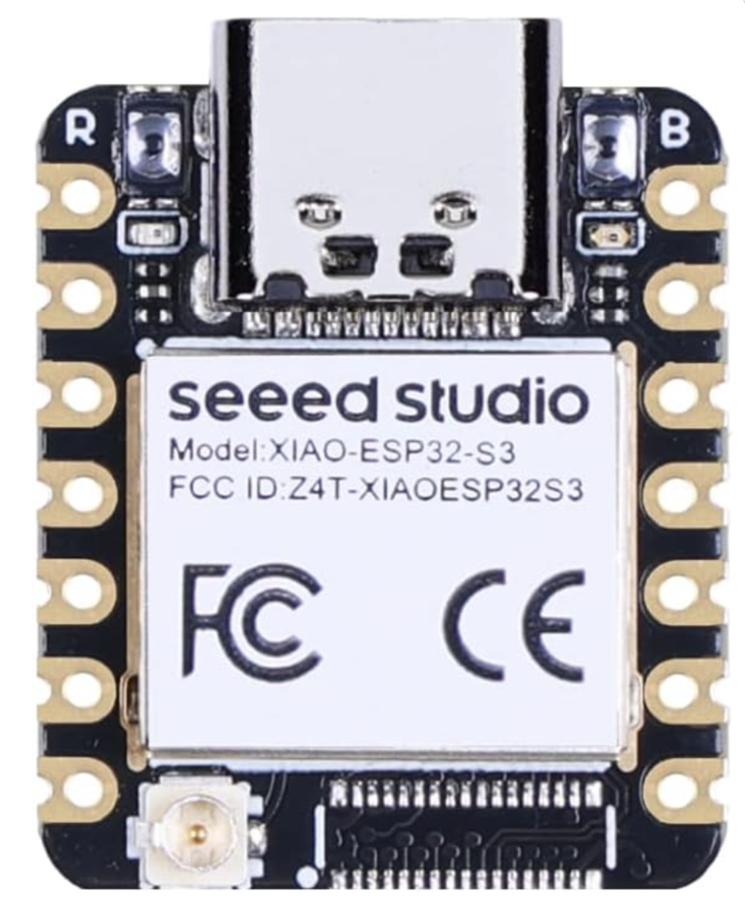
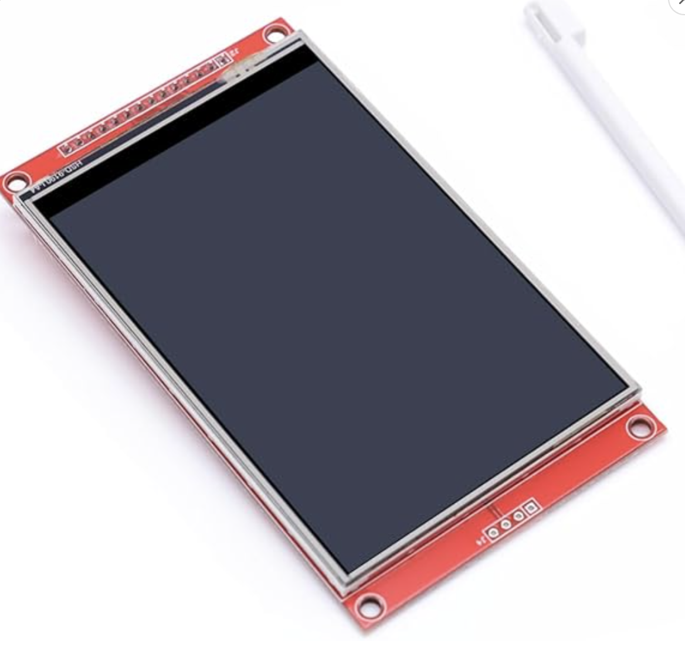
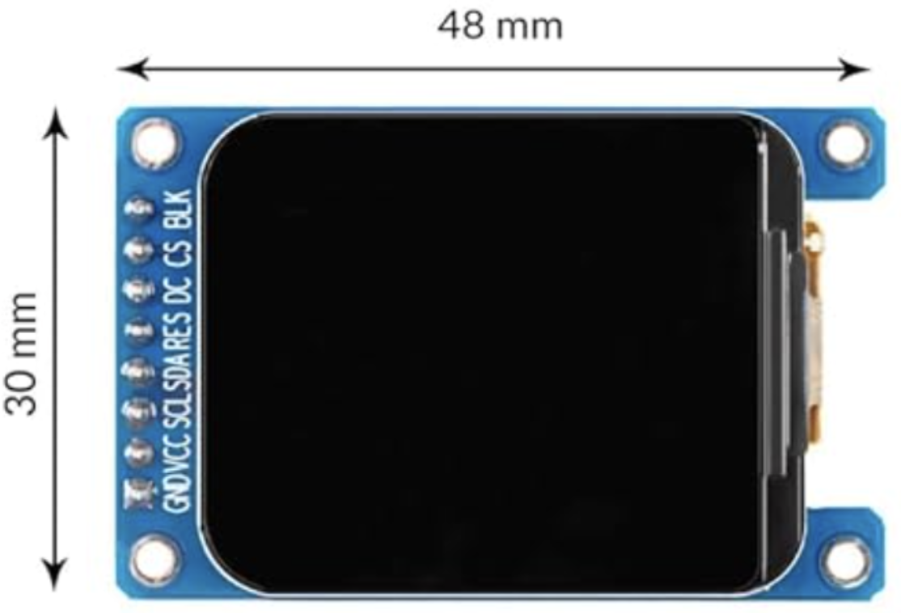
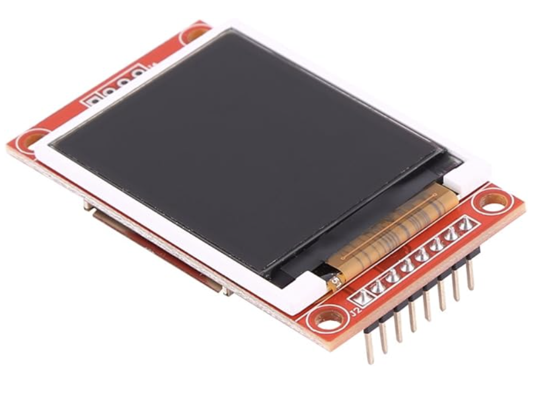

# Hardware photos

Product shots referenced by the *Examples and hardware* tables in the component
documentation, [`components/lvgl_clock/README.md`](../../components/lvgl_clock/README.md).
**Keep the filenames** — that README links to them by path.

| | File | Shows |
| --- | --- | --- |
|  | `esp32_s3_devkitc1.png` | ESP32-S3-DevKitC-1 (N16R8) — PSRAM, for the large canvases |
|  | `xiao_esp32s3.png` | Seeed Studio XIAO ESP32-S3 — what both multi-board builds use |
|  | `tft_4_0_st7796.png` | 4.0″ ST7796 SPI panel, 320×480 |
|  | `tft_1_69_st7789v2.png` | 1.69″ ST7789V2 SPI panel, 240×280 |
|  | `tft_1_8_st7735.png` | 1.8″ ST7735 SPI panel, 128×160 |

The 1.28″ round GC9A01A that the 24-screen wall is built from has no shot here
— see the [build photos](../../digital_clock_clock_24_24_round_screens/) instead,
where two dozen of them are more informative than one.

## Adding one

Roughly square, 300–600 px wide, on a plain background. They are displayed at
110–150 px, so anything larger is wasted bytes and anything smaller looks soft
on a retina screen.
