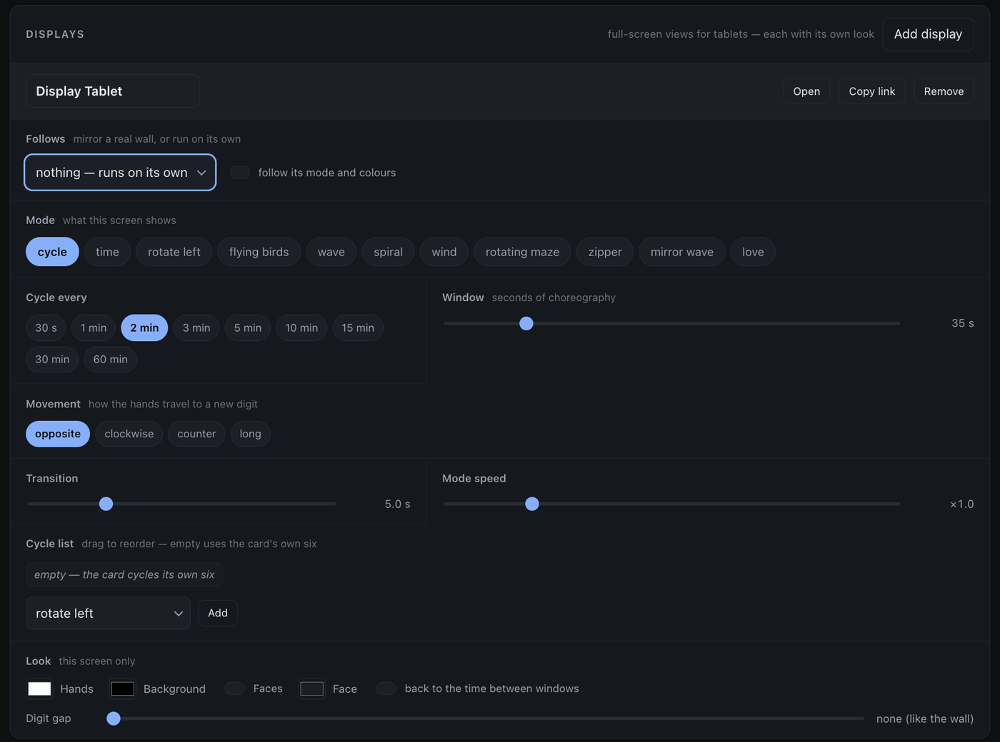

# Run it on a screen

A ClockClock 24 with **no hardware at all** — on a wall tablet, in a Home
Assistant dashboard, or in any browser you can point at a URL.

This is not a picture of the wall or an impression of it. It is the wall's own
code with a canvas instead of panels: the same
[`clockclock24` engine](./components/lvgl_clock/README.md) the eight boards run,
line for line, with the same choreographies, the same easing and the same
24-clock geometry. A mode looks the same here because it *is* the same.


*↑ A tablet in a hallway, full-screen. This is how the project started, years
before any of the hardware.*

## Three ways

| | Needs | |
|---|---|---|
| **[In any browser](https://tuct.github.io/esphome-lvgl-clock/)** | nothing | Open the link. Also where you go to try the modes before building anything |
| **A Home Assistant dashboard card** | the add-on | A clock in a dashboard column, alongside everything else in the house |
| **A full-screen display** | the add-on | Its own URL, its own colours, controls that fade out. Point a tablet at it and leave it there |

## In a dashboard

Install the [add-on](./homeassistant/README.md) and press **Install card**; the
clock card is then available to any dashboard:

```yaml
type: custom:clockclock24-card
```

That is the whole configuration for the default — telling the time, breaking
into a choreography once a minute. Everything else is optional: which modes it
cycles through, how often, the colours, the digit gap. The
[card reference](./homeassistant/DOCS.md#the-clock-card) has the full list.

## Full screen, for a tablet



A **display** is a full-screen page with its own link and its own look — black,
edge to edge, controls fading out after three seconds. **Add display** in the
add-on makes one, and it needs no dashboard and no card resource.

It is configured with the same vocabulary as a real wall — mode, cycle list,
cadence, movement, sweep length, choreography speed — plus two things a physical
wall does not have:

- **Its own colours.** A display does not follow the wall unless you ask it to,
  so the tablet in the hall can be amber while the wall in the study is white.
- **A digit gap.** Twenty-four round panels have no bezels between them, so the
  wall has no gaps. A screen does, and you can dial one in or set it to `none`
  to match the real thing.

Set **Follows** to a real wall and it mirrors that wall's mode and colours
instead — the same clock, in two rooms.

→ [Displays, in full](./homeassistant/DOCS.md#displays)

## Without Home Assistant

**[The project site](https://tuct.github.io/esphome-lvgl-clock/)** runs the same
engine with nothing installed and nothing cloned. It is the honest way to find
out whether you want one of these on your wall before spending €200 on panels.


*↑ Before the round panels: a "call button" plus a clock in ClockClock 24 style,
rendered on a screen.*

## Then what

- **[What it does — modes and patterns](./modes.md)** — the choreographies, and
  how to make your own
- **[Build it on real hardware](./digital_clock_clock_24_24_round_screens/README.md)**
  — 24 round panels, eight boards, about €210
- **[Control it from Home Assistant](./homeassistant/README.md)** — the add-on,
  which drives a real wall and these screens from the same page
